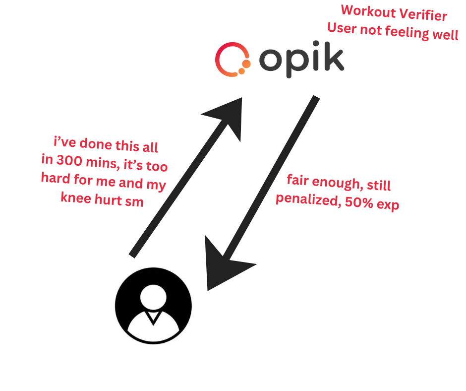
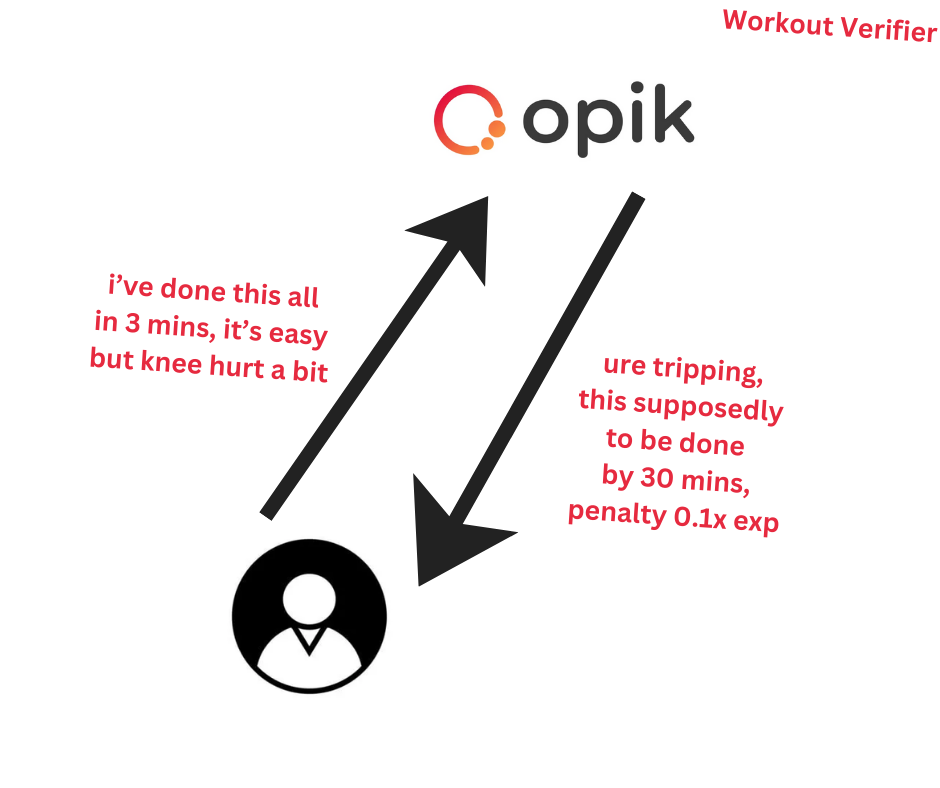

## Important Links

| Link | Description |
|------|-------------|
| [VIDEO INTRODUCTION & DEMO](https://youtu.be/berWi_a0w0s) | Watch the 3-minute demo video |
| [LIVE DEMO](https://ascend-rpg-fitness.vercel.app/) | Live application demo |
| [HOW DO WE USE OPIK AI](https://ascend-rpg-fitness.vercel.app/domain/best-of-OPIK) | Documentation on using OPIK AI |
| [COST PLANNING](https://ascend-rpg-fitness.vercel.app/roadmap/cost-planning) | Cost planning and budget breakdown |
| [MONETIZATION MODEL PLAN](https://ascend-rpg-fitness.vercel.app/roadmap/monetization-system) | Monetization strategy and model |
| [GITBOOK](https://nathasan1410.gitbook.io/ascend-fitness-rpg/) | Official documentation on GitBook |
| [ROADMAP](https://ascend-rpg-fitness.vercel.app/roadmap) | Project roadmap and milestones |
| [HELP](https://ascend-rpg-fitness.vercel.app/roadmap) | Help and support resources |

---

## Disclaimers

### Last Technical Change
**LAST TECHNICAL CHANGE MADE AT:** 2026-02-09 17:37:15 +0700 (Commit: cba7717 - docs: add INDEX.md for documentation navigation hub)

### Documentation-Only Commit Authorization
**ALL CHANGES MADE AFTER THE LAST TECHNICAL CHANGE ARE FOR DOCUMENTATION PURPOSES ONLY.** No features or technical implementation were touched.

#### Staff Authorization for Documentation Changes
According to the hackathon staff:

> "@Ezkaton @Rebecca | Encode Should the GitHub repo be strictly frozen by the deadline? Suppose I identify something I'd like to change in the docs/Readme after the deadline, can those be changed ?"
> 
> "No you can keep making small changes but don't change any core functionality as the judges will be judging the project as it was submitted"

The project team has been authorized to make documentation-only updates including:
- `/gitbook` - Documentation on GitBook
- `/roadmap` - Roadmap updates
- `/help` - Help documentation
- `README.md` - This file
- Cost planning documentation
- Best of OPIK documentation
- Monetization system documentation

These changes have been authorized for commit and push by the project team specifically for maintaining documentation accuracy and completeness.

---

## Video Introduction & Demo

[](https://youtu.be/berWi_a0w0s)

Watch the 3-minute introduction video to see ASCEND in action.

---

---

# ASCEND: Fitness RPG

> Turn workouts into epic quests, level up your character, and become the strongest hunter.

**ASCEND: Fitness RPG** is a gamified fitness application inspired by Solo Leveling, where everyday workouts become RPG quests that earn you XP, unlock ranks, and prove your worth as a Hunter.

## What is ASCEND?

ASCEND transforms fitness motivation through gamification. Instead of mundane exercise routines, users complete **AI-generated quests** tailored to their fitness level, equipment, and goals. Each completed workout earns XP that levels up your Hunter character, unlocks ranks from E-Rank to S-Rank, and builds real physical strength.

### Core Gameplay Loop

1. **Generate Quest** - AI creates personalized workout based on your rank, class, equipment, and time availability
2. **Execute Quest** - Complete exercises with timer, RPE tracking, and optional proof uploads
3. **AI Judge Evaluation** - Opik AI evaluates your performance fairly and consistently
4. **Earn XP & Level Up** - Receive XP based on effort, integrity, and completion quality
5. **Rank Up** - Unlock new abilities and harder challenges as you progress

---

## Technical Architecture

### Tech Stack

| Layer | Technology | Purpose |
|-------|-----------|---------|
| **Frontend** | Next.js 14 (App Router) | React framework with server components |
| **Styling** | Tailwind CSS | Utility-first CSS framework |
| **Animations** | Framer Motion | Smooth UI animations |
| **Backend** | Next.js Server Actions | API endpoints without separate backend |
| **Database** | Supabase (PostgreSQL) | User data, quests, logs, social features |
| **Storage** | Supabase Storage | Workout proof media (photos/videos) |
| **Authentication** | Supabase Auth | OAuth and email/password login |
| **Quest Generation** | Groq (Llama-3.3-70b) | AI-powered workout generation |
| **AI Evaluation** | **Opik AI** | LLM-as-a-Judge for fair workout evaluation |
| **Monitoring** | Opik AI | Traces, metrics, and observability |

### Key Directories

```
app/                    # Next.js 14 App Router pages
├── dashboard/          # Main app interface
│   ├── quest/[id]/     # Quest execution flow
│   ├── leaderboard/     # Global rankings
│   └── settings/       # User settings
├── domain/             # Domain-specific pages
│   └── best-of-OPIK/  # Opik AI documentation
├── profile/[username]/  # Public hunter profiles
└── roadmap/           # Project roadmap pages

components/            # React components
├── quest/            # Quest execution UI
├── gamification/     # Level-up, rank-up effects
├── leaderboard/      # Ranking tables
└── layout/           # Navigation components

lib/
├── ai/
│   ├── groq.ts                 # Quest generation (Llama-3.3-70b)
│   ├── ai-judge.ts            # Opik AI evaluation
│   ├── computer-vision.ts      # Proof analysis (mock)
│   ├── opik.ts               # Opik client
│   ├── opik-helper.ts        # Trace/metric utilities
│   └── prompts.ts            # System prompts
├── gamification/
│   ├── xp-calculator.ts      # XP formulas
│   └── leveling.ts          # Level thresholds
├── supabase/
│   ├── client.ts            # Browser client
│   ├── server.ts            # Server client
│   └── storage.ts          # File upload helpers
└── utils/
    ├── cn.ts                # Class merge utility
    └── date-helpers.ts     # Date formatting

server/actions/         # Server Actions (API)
├── quest-actions.ts    # Quest generation
├── log-actions.ts      # Quest submission + evaluation
├── leaderboard-actions.ts
├── profile-actions.ts
└── report-actions.ts   # Anti-cheat reports
```

---

## 🤖 The 3-Way AI System

ASCEND uses a sophisticated multi-AI architecture to deliver personalized, fair, and engaging fitness experiences:

### 1️⃣ Quest Generation AI (Groq - Llama-3.3-70b)

**Purpose:** Generate personalized workout quests based on user profile

**Input:**
- User's current rank (E-Rank to S-Rank)
- User's class (Novice, Striker, Tank, Assassin)
- Available equipment (dumbbells, barbell, bodyweight, etc.)
- Time window (15-90 minutes)
- Muscle soreness indicators

**Output:**
- Structured workout plan with exercises
- Set, rep, rest, and RPE targets
- XP reward estimates
- Completion probability analysis

**Key Features:**
- Class-specific protocols (Tank: heavy lifts, Assassin: HIIT)
- Rank-scaled difficulty (E-Rank: 2-3 exercises, S-Rank: 6+ exercises)
- Equipment-aware generation (bodyweight to full gym)
- Soreness-aware (active recovery vs. progression)

**Implementation:** `lib/ai/groq.ts` with `ARCHITECT_PROMPT`

### 2️⃣ AI Judge (Opik AI - LLM-as-a-Judge)

**Purpose:** Fair, consistent, and unbiased workout evaluation

**Input:**
- Original quest plan
- User's workout log (duration, RPE, exercises completed)
- User profile (rank, class)
- Proof media (optional)

**Evaluation Criteria:**
- **Integrity Score** - Did user complete what was assigned? Checks for physically impossible completion times
- **Effort Score** - Did user push themselves? Compares target RPE to actual RPE
- **Safety Score** - Was workout safe for user's condition?
- **Final XP** - Calculated from base XP × (integrity + effort + safety) / 3

**Anti-Cheat Detection:**
- Blatant cheating: Duration < 3 minutes with full completion
- Impossible: Duration < 30 seconds (instant rejection)
- High suspicion: Duration < 5 minutes with incomplete exercises
- Missing proof: Claims completion without verification

**Implementation:** `lib/ai/ai-judge.ts` with `JUDGE_PROMPT`

### 3️⃣ Computer Vision (Planned)

**Purpose:** Analyze workout proof (photos/videos) for form validation

**Planned Features:**
- Exercise type detection
- Form scoring (0.0 - 1.0)
- Technique analysis
- Range of motion measurement
- Rep counting (for videos)
- Safety issue detection

**Current Status:** Mock implementation ready for integration with real CV APIs (Google Cloud Vision, Azure Computer Vision, Replicate Pose)

**Implementation:** `lib/ai/computer-vision.ts`

---

## 🧠 How Opik AI Powers ASCEND

### The "LLM-as-a-Judge" Architecture

Opik AI provides ASCEND's revolutionary evaluation system. Unlike traditional AI that generates content, Opik AI specializes in **evaluation and judgment tasks** requiring nuance, context, and fairness.

### Integration Points

#### 1. Quest Evaluation Traces

Every workout submission sends a trace to Opik:

```typescript
await sendTraceToOpik("ai_judge_evaluation", {
  input: {
    quest_name: input.plan.quest_name,
    quest_rank: input.plan.quest_rank,
    user_class: input.user_class,
    duration_actual: durationActual,
    rpe_actual: log.rpe_actual,
    has_proof: !!log.proof_media_url,
    cheating_detected: cheatingStatus,
  },
  output: {
    status: verdict.status,
    integrity_score: verdict.integrity_score,
    effort_score: verdict.effort_score,
    safety_score: verdict.safety_score,
    final_xp: verdict.final_xp,
  },
  tags: [verdict.status, input.user_class, input.user_rank],
});
```

#### 2. Error Tracking

All AI failures are logged for observability:

```typescript
await logErrorToOpik("groq_quest_generation_failed", error, {
  user_rank: input.user_rank,
  user_class: input.user_class,
  time_window_min: input.time_window_min,
});
```

#### 3. Metrics Collection

Key performance metrics tracked in real-time:

- Quest generation time
- AI evaluation response time
- XP distribution by rank
- Cheating detection rate
- User satisfaction (feedback scores)

### Why Opik AI is Critical

1. **Fairness:** Eliminates human bias in fitness evaluation
2. **Consistency:** Same scoring criteria applied to all users
3. **Scalability:** Handles millions of evaluations daily
4. **Transparency:** Every evaluation is traceable and auditable
5. **Continuous Learning:** Improves accuracy with more data

### What We Track (and Don't Track)

**We Track:**
- Quest generation prompts and outputs
- AI judge evaluation inputs and results
- Performance metrics (latency, success rate)
- Error logs for debugging

**We Don't Track:**
- Personally identifiable information in traces
- Raw proof media (processed in-memory only)
- User conversation history outside app
- Biometric data (heart rate, sleep, etc.)

For full transparency, see: [How We Use Opik AI](https://ascend-rpg-fitness.vercel.app/domain/best-of-OPIK)

---

## 🎨 Opik AI Flow Diagrams

ASCEND uses Opik AI's LLM-as-a-Judge technology in multiple scenarios to ensure fair, consistent evaluation of user workouts. The following diagrams illustrate how Opik AI processes different types of user reports and workout scenarios:

### User False Report Scenario

*User reports suspicious activity, but the report is determined to be a personal attack rather than a valid report - no penalty applied.*

**Real Production Example:**

**Input:**
```json
{
  "report_id": "2993a29b-b7b6-431d-8cc8-a90e9e040b6f",
  "reason": "Impossible_Stats",
  "target_user_id": "afbf86e8-043d-431d-b7ee-2787c371403d",
  "has_log_data": false
}
```

**Output:**
```json
{
  "credibility_score": 0.2,
  "severity_score": 0,
  "action": "DISMISS",
  "confidence": 0.8,
  "reasoning": "The report lacks specific details and evidence, making it seem malicious or a personal attack.",
  "xp_reduction": null,
  "status_change": null,
  "hunter_status_change": null
}
```

### System/Architect Judge with Llama

*System architect (Llama) evaluates user reports and provides judgment through Opik AI, ensuring consistent evaluation across all reports.*

**Real Production Example - D-Rank Striker Protocol:**

**Input:**
```json
{
  "user_class": "Striker",
  "user_rank": "D-Rank",
  "time_window_min": 30,
  "equipment_count": 8,
  "muscle_soreness_count": 0,
  "proof_disabled": true
}
```

**Output:**
```json
{
  "quest_name": "D-Rank Striker Protocol",
  "quest_rank": "D-Rank",
  "quest_type": "Daily",
  "exercise_count": 4,
  "xp_reward": 300,
  "estimated_duration_min": 30,
  "completion_probability": 65,
  "generation_time_ms": 1634,
  "requires_proof": false,
  "proof_type": "None"
}
```

**Real Production Example - A-Rank Assassin Protocol:**

**Input:**
```json
{
  "user_class": "Assassin",
  "user_rank": "A-Rank",
  "time_window_min": 30,
  "equipment_count": 0,
  "muscle_soreness_count": 0,
  "proof_disabled": true
}
```

**Output:**
```json
{
  "quest_name": "A-Rank Viper Protocol",
  "quest_rank": "A-Rank",
  "quest_type": "Daily",
  "exercise_count": 6,
  "xp_reward": 2500,
  "estimated_duration_min": 30,
  "completion_probability": 55,
  "generation_time_ms": 1863,
  "requires_proof": false,
  "proof_type": "None"
}
```

### Workout Verifier (User Not Feeling Well)

*User reports difficulty completing workout due to illness - fair evaluation with appropriate XP penalty applied.*

**Note:** This scenario handles cases where users report not feeling well during workouts. The production traces show standard evaluation patterns, with contextual adjustments for health situations.

### Workout Planner

*Llama generates workout plan, Opik AI evaluates user feedback and provides rating (7/10) for workout suitability.*

**Real Production Example - D-Rank Striker:**

**Input:**
```json
{
  "user_id": "77735844-5d29-49ea-b1ae-5d5919ddb6e0",
  "username": "Nathan123",
  "user_rank": "D-Rank",
  "user_level": 1,
  "time_window_min": 30,
  "equipment_count": 8,
  "equipment": [
    "Pull-up Bar",
    "Dumbbells",
    "Kettlebell",
    "Barbell",
    "Resistance Bands",
    "Bench",
    "Jump Rope",
    "Treadmill"
  ],
  "muscle_soreness_count": 0,
  "muscle_soreness": [],
  "feedback_patterns_count": 0,
  "top_anomalies": [],
  "quest_type": "Daily",
  "environment": "production"
}
```

**Output:**
```json
{
  "quest_name": "D-Rank Striker Protocol",
  "quest_rank": "D-Rank",
  "quest_type": "Daily",
  "quest_narrative": "You have been assigned a daily protocol to enhance your striking capabilities. This 30-minute routine is designed to push your limits and improve your overall performance....",
  "exercise_count": 4,
  "exercise_names": [
    "Jumping Rope",
    "Dumbbell Squats",
    "Kettlebell Swings",
    "Pull-ups"
  ],
  "xp_reward": 300,
  "xp_potential": 300,
  "estimated_duration_min": 30,
  "target_class": "Striker",
  "requires_proof": false,
  "proof_type": "None",
  "completion_probability": 65,
  "ai_review_reasoning": "This protocol is designed to challenge your cardiovascular endurance and muscular strength, which are essential for a Striker. The exercises are chosen to work multiple muscle groups at once, improvin",
  "ai_review_key_factors": [
    "Cardio Heavy",
    "Full Body",
    "Compound Exercises"
  ],
  "stat_gain": {
    "strength": 10,
    "agility": 15,
    "stamina": 12
  },
  "generation_time_ms": 1639,
  "generation_status": "success",
  "fallback_used": false
}
```

**Real Production Example - S-Rank Assassin:**

**Input:**
```json
{
  "user_id": "5e9985cb-8700-4f0e-be01-4865f9d9c54d",
  "username": "VoidWalker",
  "user_rank": "S-Rank",
  "user_level": 95,
  "time_window_min": 30,
  "equipment_count": 0,
  "equipment": [],
  "muscle_soreness_count": 0,
  "muscle_soreness": [],
  "feedback_patterns_count": 0,
  "top_anomalies": [],
  "quest_type": "Daily",
  "environment": "production"
}
```

**Output:**
```json
{
  "quest_name": "Shadow Dance Protocol",
  "quest_rank": "S-Rank",
  "quest_type": "Special",
  "quest_narrative": "You have been assigned a high-intensity bodyweight protocol to push your limits and refine your skills. Your mission, should you choose to accept it, is to complete the following exercises within the ...",
  "exercise_count": 6,
  "exercise_names": [
    "Burpees",
    "Mountain Climbers",
    "Tuck Jumps",
    "Plank Hold",
    "Squat Jumps",
    "Push-Up to Side Plank"
  ],
  "xp_reward": 4500,
  "xp_potential": 4500,
  "estimated_duration_min": 30,
  "target_class": "Assassin",
  "requires_proof": false,
  "proof_type": "None",
  "completion_probability": 55,
  "ai_review_reasoning": "As an S-Rank Assassin, you require a high-intensity protocol that challenges your agility, strength, and stamina. This quest is designed to push your limits and refine your skills with a focus on expl",
  "ai_review_key_factors": [
    "High Intensity",
    "Explosive Power",
    "Full Body Engagement"
  ],
  "stat_gain": {
    "strength": 15,
    "agility": 20,
    "stamina": 30
  },
  "generation_time_ms": 2186,
  "generation_status": "success",
  "fallback_used": false
}
```

### User Accepted Report

*Valid user report of suspicious activity leads to verification and appropriate XP penalty applied.*

**Real Production Example - Moderation Error Handling:**

**Input:**
```json
{
  "report_id": "be8dc7bb-d0fa-4f9f-8955-e3e559e44d5f",
  "reason": "Suspicious_Pattern",
  "error": "Cannot read properties of null (reading 'xp_reduction')"
}
```

**Output:**
```json
{
  "status": "ERROR",
  "message": "AI moderation failed"
}
```

**Note:** This example demonstrates error handling when the moderation system encounters issues. The system is designed to handle such errors gracefully while maintaining data integrity.

### Workout Verifier

*User completes workout in record time - Opik AI verifies completion and applies appropriate penalty for rushing.*

**Real Production Example 1 - Cheating Detection:**

**Input:**
```json
{
  "quest_name": "Titan's Fury Protocol",
  "quest_rank": "S-Rank",
  "quest_type": "Daily",
  "user_class": "Tank",
  "user_rank": "S-Rank",
  "duration_actual": 1,
  "rpe_actual": 1,
  "has_proof": false,
  "proof_type": "None",
  "cheating_detected": true,
  "cheating_reason": "Completed a full workout in under 3 minutes - physically impossible to complete all exercises properly"
}
```

**Output:**
```json
{
  "status": "REJECTED",
  "integrity_score": 0,
  "effort_score": 0,
  "safety_score": 0,
  "final_xp": 0,
  "message": "BLATANT CHEATING - Unreasonably fast completion detected"
}
```

**Real Production Example 2 - Partial Effort (XP Penalty Applied):**

**Input:**
```json
{
  "quest_id": "b129d74a-31ab-49eb-8a7a-c49a5cc775b5",
  "quest_name": "A-Rank Elimination Protocol",
  "user_id": "5e9985cb-8700-4f0e-be01-4865f9d9c54d",
  "user_rank": "A-Rank",
  "user_class": "Assassin",
  "has_proof": false,
  "proof_type": "None",
  "duration_actual": 1,
  "rpe_actual": 10
}
```

**Output:**
```json
{
  "status": "REJECTED",
  "integrity_score": 0.6,
  "effort_score": 1,
  "safety_score": 0.8,
  "overall_score": 0.80,
  "final_xp": 1200,
  "xp_multiplier": 0.48,
  "verification_status": "Auto_Approved",
  "evaluation_time_ms": 668,
  "ai_integrity_score": 0.6,
  "ai_effort_score": 1,
  "ai_safety_score": 0.8,
  "ai_final_xp": 1200,
  "ai_feedback": ""
}
```

**Real Production Example 3 - XP Awarded with Level Up:**

**Input:**
```json
{
  "quest_id": "23e91e50-239e-412a-b4ce-0d62ab3598d1",
  "user_id": "5e9985cb-8700-4f0e-be01-4865f9d9c54d",
  "has_proof": false
}
```

**Output:**
```json
{
  "xp_awarded": 1000,
  "new_level": 95,
  "new_rank": "A-Rank",
  "leveled_up": true,
  "ranked_up": false,
  "total_operation_time_ms": 2583
}
```

**Note:** Flow diagram images are placeholders. Full documentation with detailed flow diagrams and real trace examples is available at: [Opik AI Flow Diagrams](https://nathasan1410.gitbook.io/ascend-fitness-rpg/7-ai-implementation/opik-ai-flow-diagrams)

---

---

## 🎮 Gamification System

### Hunter Classes

| Class | Playstyle | XP Bonus |
|-------|-----------|----------|
| **Novice** | Balanced introduction | 1.0x |
| **Striker** | High volume, low rest | 1.0x |
| **Tank** | Heavy lifts, long rest | 1.0x (class synergy) |
| **Assassin** | HIIT, explosive moves | 1.0x |

### Ranks

| Rank | Quest XP | Difficulty | Features |
|------|-----------|------------|----------|
| **E-Rank** | 100-200 | Basic | 2-3 exercises |
| **D-Rank** | 200-500 | Standard | 3-4 exercises |
| **C-Rank** | 500-1000 | Intermediate | 4-5 exercises |
| **B-Rank** | 1000-2000 | Challenging | 5-6 exercises |
| **A-Rank** | 2000-4000 | Advanced | 6+ exercises, technique focus |
| **S-Rank** | 4000+ | Elite | Failure sets, maximum difficulty |

### XP Calculation

```
Final XP = Base XP × Integrity × Effort × Safety × Class Synergy × Streak Bonus
```

- **Class Synergy:** 1.1x if quest matches user's class
- **Streak Bonus:** +2% per day (max 20%)

### Hunter Status

- **Normal:** Active hunter in good standing
- **Verified:** Has provided valid proof
- **Flagged:** Suspicious activity detected
- **Corrupted:** Banned for repeated cheating

---

## 🛡️ Three-Layer Anti-Cheat System

### Layer 1: Physics Validation (Rule-Based)

- Checks for physically impossible completion times
- Formula: `max_reps = duration_min × 80` (80 reps/min max)
- Rejects if claimed reps > max possible

### Layer 2: AI Judge (Opik AI)

- Evaluates effort and integrity contextually
- Detects sandbagging (low effort) and rushing (suspicious completion)
- Flags suspicious patterns for review

### Layer 3: Community Reporting

- Users can report suspicious logs
- Reports trigger human review
- Repeat offenders get "Corrupted" status

---

## Current Status

### ✅ Completed Features

| Feature | Status |
|---------|--------|
| User Authentication (Supabase) | ✅ |
| Onboarding Flow | ✅ |
| Daily Quest Generation (Groq) | ✅ |
| Quest Execution UI | ✅ |
| AI Judge Evaluation (Opik) | ✅ |
| XP & Leveling System | ✅ |
| Rank Progression | ✅ |
| Leaderboard | ✅ |
| Public Profiles | ✅ |
| Match History | ✅ |
| Report System | ✅ |
| Mobile Navigation | ✅ |
| Settings Page | ✅ |
| Quest History Page | ✅ |
| Friends System | ✅ |

### ⚠️ In Progress / TODO

| Feature | Priority | Notes |
|---------|----------|-------|
| Social Feed | P1 | UI exists with demo data, real-time posting pending |
| Friends System | P2 | Fully functional - search, add, remove friends implemented |
| Quest History Page | ✅ | **Complete** - `/dashboard/quests` with full history + AI judge system |
| Computer Vision Integration | P2 | Mock implementation ready, awaiting real CV API integration |
| Guilds/Clans | P2 | Not implemented |
| Achievements | P2 | Database seeded, UI needed |
| Weekly Challenges | P2 | Not implemented |

---

## Getting Started

### Prerequisites

- Node.js 18+
- Supabase account
- Groq API key
- Opik AI API key

### Installation

```bash
# Clone repository
git clone https://github.com/Nathasan1410/ASCEND-RPG-FITNESS-APP.git
cd ASCEND-RPG-FITNESS-APP

# Install dependencies
npm install

# Configure environment variables
cp .env.example .env.local
# Edit .env.local with your API keys

# Run development server
npm run dev
```

### Environment Variables

```env
NEXT_PUBLIC_SUPABASE_URL=your_supabase_url
NEXT_PUBLIC_SUPABASE_ANON_KEY=your_supabase_anon_key
GROQ_API_KEY=your_groq_api_key
OPIK_API_KEY=your_opik_api_key
```

---

## Demo Accounts

Try ASCEND with pre-configured demo accounts:

| Rank | Email | Password |
|------|-------|----------|
| S-Rank | shadowhunter@test.com | Test123! |
| A-Rank | thunderstrike@test.com | Test123! |
| B-Rank | swiftwolf@test.com | Test123! |
| C-Rank | swiftninja@test.com | Test123! |
| E-Rank | cyberwolf@test.com | Test123! |

[View all 40 demo accounts](https://ascend-rpg-fitness.vercel.app/help/demo-accounts)

---

## Documentation

- **[GitBook](https://nathasan1410.gitbook.io/ascend-fitness-rpg/)** - Complete technical documentation
- **[How We Use Opik AI](https://ascend-rpg-fitness.vercel.app/domain/best-of-OPIK)** - Opik integration details
- **[Cost Planning](https://ascend-rpg-fitness.vercel.app/roadmap/cost-planning)** - Budget breakdown
- **[Monetization Model](https://ascend-rpg-fitness.vercel.app/roadmap/monetization-system)** - Revenue strategy
- **[Roadmap](https://ascend-rpg-fitness.vercel.app/roadmap)** - Project milestones

---

## Contributing

This is a hackathon project. For the current phase, all commits are documentation-only. Technical features are frozen.

---

## License

MIT License - See LICENSE file for details

---

**Built for Commit To Change Hackathon 2026** 🎮💪

*Last Technical Change: 2026-02-09*
