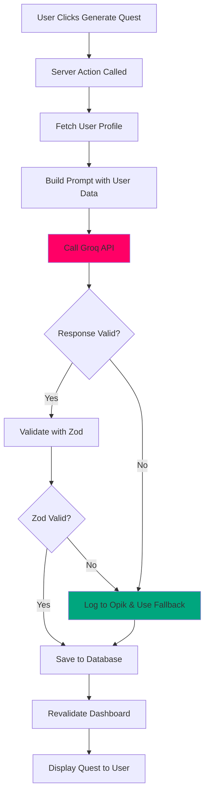
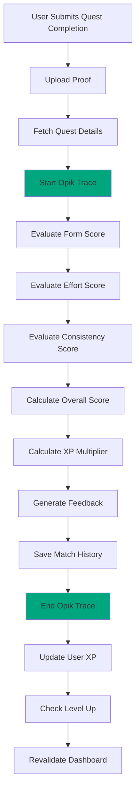

# AI Integration

> Groq LLM for quest generation and Opik AI Judge for evaluation

---

## AI Architecture Overview

ASCEND: FITNESS RPG integrates two AI services:

1. **Groq LLM** - Quest generation using Llama 3.3 70B
2. **Opik** - AI judge evaluation and monitoring

### AI Integration Diagram

```mermaid
graph LR
  User[User] --> Dashboard[Dashboard]
  Dashboard -->|Request Quest| Groq[Groq LLM]
  Groq -->|Quest JSON| Database[Supabase DB]
  Database -->|Quest Data| Dashboard
  Dashboard -->|Complete Quest| Judge[AI Judge]
  Judge --> Opik[Opik Trace]
  Judge -->|Evaluation| Database
  Database -->|XP Awarded| User

  style User fill:#00FFFF
  style Dashboard fill:#3ECF8E
  style Groq fill:#FF0066
  style Opik fill:#00A67E
  style Database fill:#24282D
  style Judge fill:#F59E0B
```



---

## Groq Quest Generation

### Setup and Configuration

```typescript
import Groq from 'groq-sdk';

const groq = new Groq({
  apiKey: process.env.GROQ_API_KEY,
});

const QUEST_MODEL = 'llama-3.3-70b-versatile';
const TEMPERATURE = 0.7;
const MAX_TOKENS = 1000;
```

### System Prompt

```typescript
const SYSTEM_PROMPT = `You are an expert fitness trainer and RPG quest designer.

Generate personalized workout quests based on:
- User's current rank (E-S) - Higher ranks = more complex workouts
- Available equipment - Adapt exercises to available tools
- Fitness goals - Focus on user's primary objectives
- Time constraints - Respect duration limits
- Class specialization (Tank/Striker/Assassin) - Tailor to playstyle

Response Format (JSON):
{
  "title": "Epic quest name (RPG-themed)",
  "description": "Narrative description of the quest",
  "difficulty": "E|D|C|B|A|S",
  "duration_minutes": 30-90,
  "xp_reward": 50-4000,
  "exercises": [
    {
      "name": "Exercise name",
      "type": "reps|timed|distance",
      "sets": number,
      "value": number,
      "target_muscle": ["primary", "secondary"],
      "instructions": ["step 1", "step 2"]
    }
  ],
  "warm_up": [
    {
      "name": "Warm-up exercise",
      "type": "reps|timed",
      "sets": 1,
      "value": 30
    }
  ],
  "cool_down": [
    {
      "name": "Cool-down exercise",
      "type": "timed",
      "sets": 1,
      "value": 30
    }
  ],
  "class_specialization": {
    "Tank": "Additional endurance-focused modifiers",
    "Striker": "Power and explosiveness modifiers",
    "Assassin": "Agility and flexibility modifiers"
  }
}

XP Reward Formula:
- E-Rank: 50-150 XP
- D-Rank: 150-400 XP
- C-Rank: 400-800 XP
- B-Rank: 800-1200 XP
- A-Rank: 1200-2000 XP
- S-Rank: 2000-4000 XP`;
```

### Quest Generation Function

```typescript
interface UserProfile {
  rank_tier: 'E' | 'D' | 'C' | 'B' | 'A' | 'S';
  class: 'Tank' | 'Striker' | 'Assassin';
  goals: string[];
  equipment: string[];
  level: number;
}

interface Quest {
  title: string;
  description: string;
  difficulty: string;
  duration_minutes: number;
  xp_reward: number;
  exercises: Exercise[];
  warm_up?: Exercise[];
  cool_down?: Exercise[];
  class_specialization?: Record<string, any>;
}

export async function generateQuestWithGroq(
  profile: UserProfile
): Promise<Quest> {
  try {
    const userPrompt = `
Generate a workout quest for a user with:
- Rank: ${profile.rank_tier}
- Class: ${profile.class}
- Level: ${profile.level}
- Goals: ${profile.goals.join(', ')}
- Equipment: ${profile.equipment.join(', ')}

The quest should be challenging but achievable, with exercises that match their goals and available equipment.`;

    const response = await groq.chat.completions.create({
      messages: [
        { role: 'system', content: SYSTEM_PROMPT },
        { role: 'user', content: userPrompt }
      ],
      model: QUEST_MODEL,
      temperature: TEMPERATURE,
      max_tokens: MAX_TOKENS,
      response_format: { type: 'json_object' },
    });

    const quest = JSON.parse(response.choices[0].message.content || '{}');

    // Validate quest structure
    if (!quest.title || !quest.exercises || !Array.isArray(quest.exercises)) {
      throw new Error('Invalid quest structure');
    }

    return quest;
  } catch (error) {
    // Log error to Opik
    await opik.trace('groq_generation_error', {
      error: error instanceof Error ? error.message : 'Unknown error',
      user_rank: profile.rank_tier,
      timestamp: new Date().toISOString(),
    });

    // Fallback to template quest
    return generateFallbackQuest(profile);
  }
}

function generateFallbackQuest(profile: UserProfile): Quest {
  const baseQuests: Record<string, Quest> = {
    'E': {
      title: 'Gatekeeper Protocol',
      description: 'Begin your journey with foundational exercises.',
      difficulty: 'E',
      duration_minutes: 20,
      xp_reward: 50,
      exercises: [
        {
          name: 'Bodyweight Squats',
          type: 'reps',
          sets: 3,
          value: 10,
          target_muscle: ['quadriceps', 'glutes'],
          instructions: ['Stand with feet shoulder-width apart', 'Lower body until thighs parallel to floor', 'Return to starting position']
        }
      ]
    },
    'D': {
      title: 'Dungeon Raid: Core',
      description: 'Strengthen your core with this workout.',
      difficulty: 'D',
      duration_minutes: 30,
      xp_reward: 200,
      exercises: [
        {
          name: 'Plank',
          type: 'timed',
          sets: 3,
          value: 30,
          target_muscle: ['core', 'shoulders'],
          instructions: ['Hold push-up position', 'Keep body in straight line', 'Engage core']
        }
      ]
    }
  };

  return baseQuests[profile.rank_tier] || baseQuests['E'];
}
```

### Response Validation

```typescript
import { z } from 'zod';

const exerciseSchema = z.object({
  name: z.string(),
  type: z.enum(['reps', 'timed', 'distance']),
  sets: z.number().min(1).max(10),
  value: z.number().positive(),
  target_muscle: z.array(z.string()),
  instructions: z.array(z.string()).min(1),
});

const questSchema = z.object({
  title: z.string().min(5).max(100),
  description: z.string().min(10).max(500),
  difficulty: z.enum(['E', 'D', 'C', 'B', 'A', 'S']),
  duration_minutes: z.number().min(15).max(90),
  xp_reward: z.number().min(50).max(4000),
  exercises: z.array(exerciseSchema).min(3).max(8),
  warm_up: z.array(exerciseSchema).optional(),
  cool_down: z.array(exerciseSchema).optional(),
  class_specialization: z.record(z.any()).optional(),
});

export function validateQuest(data: any): Quest {
  return questSchema.parse(data);
}
```

---

## Opik AI Judge

### Integration Setup

```typescript
import { opik } from '@opik/opik-nodejs';

opik.init({
  apiKey: process.env.OPIK_API_KEY,
  workspace: process.env.OPIK_WORKSPACE,
  projectName: 'ascend-fitness-rpg',
});
```

### Judge Evaluation System

```typescript
interface QuestEvaluation {
  form_score: number;        // 0-1
  effort_score: number;      // 0-1
  consistency_score: number; // 0-1
  overall_score: number;     // 0-1
  xp_multiplier: number;     // 0.8-1.5x
  feedback: string;
  suggestions: string[];
}

export async function evaluateQuestWithOpik(
  params: {
    quest: Quest;
    proofUrl: string;
    duration: number;
    notes?: string;
  }
): Promise<QuestEvaluation> {
  // Start Opik trace
  const trace = await opik.trace('quest_evaluation', {
    quest_id: params.quest.id,
    difficulty: params.quest.difficulty,
    duration_minutes: params.duration,
  });

  try {
    // Evaluate form score
    const formScore = await evaluateFormScore(params, trace);

    // Evaluate effort score
    const effortScore = await evaluateEffortScore(params, trace);

    // Evaluate consistency score
    const consistencyScore = await evaluateConsistencyScore(params, trace);

    // Calculate overall score
    const overallScore = (formScore + effortScore + consistencyScore) / 3;

    // Calculate XP multiplier
    const xpMultiplier = calculateXPMultiplier(overallScore, params.quest.difficulty);

    // Generate feedback
    const feedback = generateFeedback(overallScore, params.quest.difficulty);

    const suggestions = generateSuggestions({
      formScore,
      effortScore,
      consistencyScore,
    });

    const evaluation: QuestEvaluation = {
      form_score: formScore,
      effort_score: effortScore,
      consistency_score: consistencyScore,
      overall_score: overallScore,
      xp_multiplier: xpMultiplier,
      feedback,
      suggestions,
    };

    // End trace with results
    await trace.end({
      output: evaluation,
      metrics: {
        form_score: formScore,
        effort_score: effortScore,
        consistency_score: consistencyScore,
        overall_score: overallScore,
        xp_multiplier: xpMultiplier,
      },
    });

    return evaluation;
  } catch (error) {
    await trace.end({
      error: error instanceof Error ? error.message : 'Unknown error',
    });
    throw error;
  }
}
```

### Form Score Evaluation

```typescript
async function evaluateFormScore(
  params: any,
  trace: any
): Promise<number> {
  const span = await trace.startSpan('evaluate_form_score');

  try {
    // In production, this would analyze video/image proof with computer vision
    // For now, we use a simplified model based on completion data

    const { duration, quest } = params;
    const expectedDuration = quest.duration_minutes;
    const durationRatio = duration / expectedDuration;

    // Form score based on adherence to expected duration
    let formScore = 1.0;

    if (durationRatio < 0.7) {
      formScore = 0.5; // Too fast - likely cheating
    } else if (durationRatio > 1.5) {
      formScore = 0.7; // Too slow - extended breaks
    } else if (durationRatio >= 0.9 && durationRatio <= 1.1) {
      formScore = 1.0; // Perfect timing
    }

    await span.end({ metrics: { form_score: formScore } });

    return formScore;
  } catch (error) {
    await span.end({ error: String(error) });
    return 0.5; // Conservative default
  }
}
```

### Effort Score Evaluation

```typescript
async function evaluateEffortScore(
  params: any,
  trace: any
): Promise<number> {
  const span = await trace.startSpan('evaluate_effort_score');

  try {
    const { notes, quest } = params;

    // Analyze notes for effort indicators
    let effortScore = 0.8; // Base score

    if (notes) {
      const effortIndicators = [
        'challenging', 'difficult', 'hard', 'intense',
        'exhausted', 'pushed', 'maxed', 'failure'
      ];

      const positiveIndicators = notes
        .toLowerCase()
        .split(' ')
        .filter(word => effortIndicators.includes(word));

      if (positiveIndicators.length >= 2) {
        effortScore = 1.0;
      } else if (positiveIndicators.length >= 1) {
        effortScore = 0.9;
      }
    }

    await span.end({ metrics: { effort_score: effortScore } });

    return effortScore;
  } catch (error) {
    await span.end({ error: String(error) });
    return 0.8;
  }
}
```

### Consistency Score Evaluation

```typescript
async function evaluateConsistencyScore(
  params: any,
  trace: any
): Promise<number> {
  const span = await trace.startSpan('evaluate_consistency_score');

  try {
    // Fetch user's recent completions for consistency check
    const supabase = createClient();
    const { data: recentCompletions } = await supabase
      .from('match_history')
      .select('judge_overall_score, completed_at')
      .eq('user_id', params.user_id)
      .order('completed_at', { ascending: false })
      .limit(10);

    if (!recentCompletions || recentCompletions.length < 3) {
      await span.end({ metrics: { consistency_score: 0.8 } });
      return 0.8; // Not enough data
    }

    // Calculate average of recent scores
    const recentScores = recentCompletions
      .map(c => c.judge_overall_score)
      .filter(s => s !== null) as number[];

    const averageScore = recentScores.reduce((a, b) => a + b, 0) / recentScores.length;

    await span.end({ metrics: { consistency_score: averageScore } });

    return averageScore;
  } catch (error) {
    await span.end({ error: String(error) });
    return 0.8;
  }
}
```

### XP Multiplier Calculation

```typescript
function calculateXPMultiplier(
  overallScore: number,
  difficulty: string
): number {
  const baseMultiplier = 1.0;

  // Difficulty-based modifiers
  const difficultyModifiers: Record<string, number> = {
    'E': 0.9,
    'D': 0.95,
    'C': 1.0,
    'B': 1.05,
    'A': 1.1,
    'S': 1.2,
  };

  // Performance-based modifiers
  let performanceMultiplier = 1.0;

  if (overallScore >= 0.95) {
    performanceMultiplier = 1.5; // Perfect execution
  } else if (overallScore >= 0.85) {
    performanceMultiplier = 1.2; // Excellent
  } else if (overallScore >= 0.7) {
    performanceMultiplier = 1.0; // Good
  } else if (overallScore >= 0.5) {
    performanceMultiplier = 0.9; // Acceptable
  } else {
    performanceMultiplier = 0.8; // Needs improvement
  }

  return baseMultiplier * difficultyModifiers[difficulty] * performanceMultiplier;
}
```

---

## Data Flow

### Complete Quest Generation Flow



### Complete Evaluation Flow



---

## Error Handling

### Robust Error Handling

```typescript
export async function safeGenerateQuest(
  profile: UserProfile
): Promise<{ success: boolean; quest?: Quest; error?: string }> {
  try {
    const quest = await generateQuestWithGroq(profile);
    return { success: true, quest };
  } catch (error) {
    // Log to Opik for monitoring
    await opik.trace('generation_error', {
      error: error instanceof Error ? error.message : 'Unknown error',
      user_id: profile.id,
      timestamp: new Date().toISOString(),
    });

    // Return fallback quest
    const fallback = generateFallbackQuest(profile);
    return { success: true, quest: fallback };
  }
}

export async function safeEvaluateQuest(
  params: any
): Promise<{ success: boolean; evaluation?: QuestEvaluation; error?: string }> {
  try {
    const evaluation = await evaluateQuestWithOpik(params);
    return { success: true, evaluation };
  } catch (error) {
    // Log to Opik
    await opik.trace('evaluation_error', {
      error: error instanceof Error ? error.message : 'Unknown error',
      quest_id: params.quest.id,
      timestamp: new Date().toISOString(),
    });

    // Return conservative default evaluation
    const defaultEvaluation: QuestEvaluation = {
      form_score: 0.8,
      effort_score: 0.8,
      consistency_score: 0.8,
      overall_score: 0.8,
      xp_multiplier: 1.0,
      feedback: 'Unable to complete evaluation. Default scores applied.',
      suggestions: [],
    };

    return { success: true, evaluation: defaultEvaluation };
  }
}
```

---

## Monitoring and Metrics

### Tracked Metrics

```typescript
// Metrics tracked in Opik
const trackedMetrics = {
  // Quest Generation
  'quest_generation_success_rate': {
    description: 'Percentage of successful quest generations',
    type: 'percentage',
  },
  'quest_generation_latency': {
    description: 'Time to generate quest in seconds',
    type: 'duration',
  },
  'fallback_usage_rate': {
    description: 'Percentage of fallback quest usage',
    type: 'percentage',
  },

  // Quest Evaluation
  'evaluation_success_rate': {
    description: 'Percentage of successful evaluations',
    type: 'percentage',
  },
  'evaluation_latency': {
    description: 'Time to complete evaluation in seconds',
    type: 'duration',
  },

  // Score Distribution
  'form_score_distribution': {
    description: 'Distribution of form scores',
    type: 'histogram',
  },
  'effort_score_distribution': {
    description: 'Distribution of effort scores',
    type: 'histogram',
  },
  'consistency_score_distribution': {
    description: 'Distribution of consistency scores',
    type: 'histogram',
  },
  'xp_multiplier_distribution': {
    description: 'Distribution of XP multipliers',
    type: 'histogram',
  },
};
```

### Dashboard Integration

```typescript
// Example: Fetch evaluation metrics from Opik
export async function getEvaluationMetrics(
  timeRange: '24h' | '7d' | '30d' = '7d'
) {
  const trace = await opik.trace('fetch_metrics');

  try {
    const metrics = await opik.metrics.get({
      project: 'ascend-fitness-rpg',
      time_range: timeRange,
      metrics: [
        'evaluation_success_rate',
        'evaluation_latency',
        'form_score_distribution',
        'xp_multiplier_distribution',
      ],
    });

    await trace.end({ output: metrics });

    return metrics;
  } catch (error) {
    await trace.end({ error: String(error) });
    throw error;
  }
}
```

---

*Last Updated: February 5, 2026*
