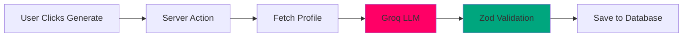
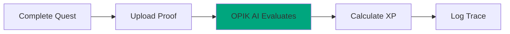

# Architecture

## Tech Stack

| Frontend | Backend | AI |
|-----------|---------|-----|
| Next.js 14 (App Router) | Supabase (PostgreSQL 15) | Groq LLM (Llama 3.3 70B) |
| React 18+ | Supabase Auth | OPIK AI (LLM-as-a-Judge) |
| TypeScript 5 | Supabase Storage | OPIK SDK |
| Tailwind CSS 3.4 | Supabase Edge Functions | |
| Framer Motion | | |
| Lucide React | | |

## Data Flow

**Quest Generation**

**Quest Evaluation**

## Security

Row-Level Security (RLS) policies restrict data access. Users can only see own data. XP cannot be manipulated by others. Proof uploads private to user. Leaderboards show anonymized data.

## Database

**Key Tables**
- profiles (user stats)
- quests (generated workouts)
- match_history (completions)
- social_feed (posts)
- friends (relationships)
- reports (community reports)

**Relationships**
- profiles → quests (one-to-many)
- profiles → match_history (one-to-many)
- profiles → social_feed (one-to-many)

## Performance

**Frontend** - Code splitting, image optimization, lazy loading, memoization

**Backend** - Database indexes, connection pooling, caching, CDN for static assets

[Technical Details](./system-overview.md) • [Backend](./backend-architecture.md) • [Frontend](./frontend-architecture.md) • [Database](./schema.md)

---

*Last Updated: February 10, 2026*
