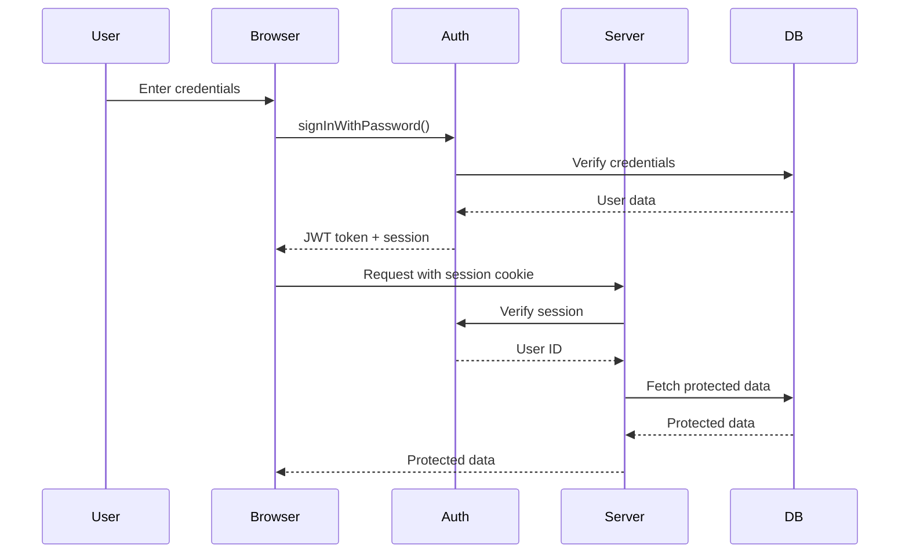

# Backend Architecture

> Serverless architecture with Supabase, server actions, and edge deployment

---

## Backend Overview

ASCEND: FITNESS RPG uses a **serverless backend** built on Supabase, leveraging:

- **Supabase Auth** - User authentication and session management
- **PostgreSQL Database** - Data persistence with Row-Level Security
- **Supabase Storage** - File storage for workout proofs
- **Supabase Edge Functions** - Serverless compute for AI integrations
- **Next.js Server Actions** - Type-safe server-side mutations

### Architecture Diagram

```mermaid
graph TB
  subgraph "Client Layer"
      Browser[Browser/Next.js App]
  end

  subgraph "Supabase Layer"
      Auth[Supabase Auth]
      DB[(PostgreSQL Database)]
      Storage[Supabase Storage]
      Edge[Supabase Edge Functions]
  end

  subgraph "External Services"
      Groq[Groq LLM API]
      Opik[Opik AI Monitoring]
  end

  subgraph "Next.js Server"
      ServerActions[Server Actions]
  end

  Browser -->|Auth| Auth
  Browser -->|Queries| DB
  Browser -->|Uploads| Storage
  Browser --> ServerActions
  ServerActions --> DB
  ServerActions --> Storage
  ServerActions --> Groq
  ServerActions --> Opik
  Auth --> DB
  Storage --> DB
  Edge --> DB
  DB --> Groq
  DB --> Opik

  style Browser fill:#3ECF8E
  style Auth fill:#FF5722
  style DB fill:#24282D
  style Storage fill:#FF5722
  style Edge fill:#FF5722
  style Groq fill:#FF0066
  style Opik fill:#00A67E
  style ServerActions fill:#3ECF8E
```



---

## Supabase Architecture

### Services Breakdown

| Service | Purpose | Use Case |
|---------|---------|----------|
| **Supabase Auth** | User authentication | Login, signup, session management |
| **PostgreSQL** | Relational database | Profiles, quests, match history |
| **Supabase Storage** | Object storage | Workout proofs, avatars |
| **Edge Functions** | Serverless compute | AI integrations, webhooks |
| **Realtime** | Live subscriptions | Live leaderboard, notifications |
| **PostgREST** | REST API auto-generated | Direct database queries |

### Serverless Benefits

1. **No Infrastructure Management:** No servers to provision or maintain
2. **Auto-Scaling:** Handles traffic spikes automatically
3. **Global Edge:** Low latency worldwide
4. **Cost Efficient:** Pay per use, not idle time
5. **Type-Safe:** Generated TypeScript types from database schema

---

## Server Components

Next.js **Server Components** are used by default for optimal performance:

### When to Use Server Components

| Use Case | Example |
|----------|---------|
| Direct database access | Fetching user profile |
| API calls without client data | Quest generation |
| SEO-critical content | Landing page |
| Reducing bundle size | Heavy components |

### Server Component Example

```typescript
// app/dashboard/page.tsx
import { createClient } from '@/lib/supabase/server';
import { QuestCard } from '@/components/quest/QuestCard';

export default async function DashboardPage() {
  const supabase = createClient();
  
  // Server-side data fetch
  const { data: { user } } = await supabase.auth.getUser();
  
  const { data: profile } = await supabase
    .from('profiles')
    .select('*')
    .eq('id', user.id)
    .single();

  const { data: quests } = await supabase
    .from('quests')
    .select('*')
    .eq('user_id', user.id)
    .order('created_at', { ascending: false });

  return (
    <div className="dashboard">
      <StatusWindow profile={profile} />
      <div className="quest-grid">
        {quests?.map(quest => (
          <QuestCard key={quest.id} quest={quest} />
        ))}
      </div>
    </div>
  );
}
```

---

## Server Actions

Next.js **Server Actions** replace traditional API routes for mutations:

### Why Server Actions?

- ✅ Type-safe with TypeScript
- ✅ No separate API routes needed
- ✅ Automatic form handling
- ✅ Better error handling
- ✅ Built-in revalidation

### Action Structure

All server actions are located in `server/actions/`:

```
server/actions/
├── profile-actions.ts       # Onboarding, profile updates
├── quest-actions.ts         # Quest generation, completion
├── match-history-actions.ts # Match history queries
├── leaderboard-actions.ts   # Leaderboard calculations
├── report-actions.ts        # Moderation system
└── rank-up-actions.ts       # Rank-up exams
```

### Action Example: Quest Generation

```typescript
'use server';

import { createClient } from '@/lib/supabase/server';
import { revalidatePath } from 'next/cache';
import { generateQuestWithGroq } from '@/lib/ai/groq';
import { z } from 'zod';
import { questSchema } from '@/types/schemas';

export async function generateQuestAction() {
  try {
    const supabase = createClient();
    const { data: { user } } = await supabase.auth.getUser();

    if (!user) {
      return { error: 'Unauthorized' };
    }

    // Fetch user profile
    const { data: profile } = await supabase
      .from('profiles')
      .select('rank_tier, class, goals, equipment')
      .eq('id', user.id)
      .single();

    if (!profile) {
      return { error: 'Profile not found' };
    }

    // Generate quest using Groq AI
    const questData = await generateQuestWithGroq({
      rank_tier: profile.rank_tier,
      class: profile.class,
      goals: profile.goals,
      equipment: profile.equipment,
    });

    // Validate quest data
    const validatedQuest = questSchema.parse(questData);

    // Save to database
    const { data: quest, error } = await supabase
      .from('quests')
      .insert({
        user_id: user.id,
        ...validatedQuest,
      })
      .select()
      .single();

    if (error) {
      return { error: 'Failed to save quest' };
    }

    // Revalidate dashboard
    revalidatePath('/dashboard');

    return { success: true, quest };
  } catch (error) {
    if (error instanceof z.ZodError) {
      return { error: 'Invalid quest data', details: error.errors };
    }
    return { error: 'Failed to generate quest' };
  }
}
```

### Action Example: Quest Completion

```typescript
'use server';

import { createClient } from '@/lib/supabase/server';
import { revalidatePath } from 'next/cache';
import { uploadProof } from '@/lib/supabase/storage';
import { evaluateQuestWithOpik } from '@/lib/ai/opik';
import { calculateXP } from '@/lib/gamification/xp-calculator';

export async function completeQuestAction(formData: FormData) {
  try {
    const supabase = createClient();
    const { data: { user } } = await supabase.auth.getUser();

    if (!user) {
      return { error: 'Unauthorized' };
    }

    const questId = formData.get('questId') as string;
    const proofFile = formData.get('proof') as File;
    const duration = parseInt(formData.get('duration') as string);
    const notes = formData.get('notes') as string;

    // Upload proof to Supabase Storage
    const proofUrl = await uploadProof(user.id, questId, proofFile);

    // Fetch quest details
    const { data: quest } = await supabase
      .from('quests')
      .select('*')
      .eq('id', questId)
      .single();

    if (!quest) {
      return { error: 'Quest not found' };
    }

    // Evaluate with Opik AI Judge
    const evaluation = await evaluateQuestWithOpik({
      quest,
      proofUrl,
      duration,
      notes,
    });

    // Calculate final XP
    const xpEarned = calculateXP({
      baseXP: quest.xp_reward,
      formScore: evaluation.form_score,
      effortScore: evaluation.effort_score,
      consistencyScore: evaluation.consistency_score,
      xpMultiplier: evaluation.xp_multiplier,
    });

    // Save match history
    const { error } = await supabase
      .from('match_history')
      .insert({
        user_id: user.id,
        quest_id: questId,
        started_at: new Date(Date.now() - duration * 60 * 1000).toISOString(),
        completed_at: new Date().toISOString(),
        actual_duration_minutes: duration,
        xp_earned: xpEarned,
        proof_url: proofUrl,
        notes: notes,
        judge_form_score: evaluation.form_score,
        judge_effort_score: evaluation.effort_score,
        judge_consistency_score: evaluation.consistency_score,
        judge_overall_score: evaluation.overall_score,
        judge_xp_multiplier: evaluation.xp_multiplier,
        judge_feedback: evaluation.feedback,
        judge_suggested_improvements: evaluation.suggestions,
      });

    if (error) {
      return { error: 'Failed to save completion' };
    }

    // Check for level-up
    await checkLevelUp(user.id, xpEarned);

    // Revalidate paths
    revalidatePath('/dashboard');
    revalidatePath('/profile');

    return { success: true, xpEarned, evaluation };
  } catch (error) {
    return { error: 'Failed to complete quest' };
  }
}

async function checkLevelUp(userId: string, xpEarned: bigint) {
  const supabase = createClient();
  
  const { data: profile } = await supabase
    .from('profiles')
    .select('xp, level, rank_tier')
    .eq('id', userId)
    .single();

  if (!profile) return;

  const newXP = BigInt(profile.xp) + xpEarned;
  const newLevel = calculateLevel(newXP);
  const newRank = calculateRank(newLevel);

  if (newLevel !== profile.level) {
    await supabase
      .from('profiles')
      .update({
        xp: newXP.toString(),
        level: newLevel,
        rank_tier: newRank,
      })
      .eq('id', userId);
  }
}
```

---

## Database Query Patterns

### Client vs Server Queries

```typescript
// Client-side query (lib/supabase/client.ts)
import { createBrowserClient } from '@supabase/ssr';

export function createClient() {
  return createBrowserClient(
    process.env.NEXT_PUBLIC_SUPABASE_URL!,
    process.env.NEXT_PUBLIC_SUPABASE_ANON_KEY!
  );
}

// Server-side query (lib/supabase/server.ts)
import { cookies } from 'next/headers';
import { createServerClient } from '@supabase/ssr';

export function createClient() {
  const cookieStore = cookies();

  return createServerClient(
    process.env.NEXT_PUBLIC_SUPABASE_URL!,
    process.env.NEXT_PUBLIC_SUPABASE_ANON_KEY!,
    {
      cookies: {
        getAll() {
          return cookieStore.getAll();
        },
        setAll(cookiesToSet) {
          try {
            cookiesToSet.forEach(({ name, value, options }) =>
              cookieStore.set(name, value, options)
            );
          } catch {
            // Server components can't set cookies
          }
        },
      },
    }
  );
}
```

### Query Optimization

```typescript
// BAD: N+1 query problem
const quests = await supabase
  .from('quests')
  .select('*')
  .eq('user_id', userId);

for (const quest of quests.data) {
  const user = await supabase
    .from('profiles')
    .select('username')
    .eq('id', quest.user_id)
    .single();
}

// GOOD: Single query with joins
const quests = await supabase
  .from('quests')
  .select(`
    *,
    profiles!inner(
      username,
      rank_tier,
      class
    )
  `)
  .eq('user_id', userId);
```

---

## API Design

### RESTful Patterns

| Operation | Endpoint | Method | Purpose |
|-----------|----------|--------|---------|
| Create Quest | `/quests` | POST | Generate new quest |
| Read Quest | `/quests/:id` | GET | Fetch quest details |
| Complete Quest | `/quests/:id/complete` | POST | Submit completion |
| Get Match History | `/match-history` | GET | User's completions |
| Get Leaderboard | `/leaderboard` | GET | Top hunters |
| Report User | `/reports` | POST | File report |
| Rank-Up Request | `/rank-up-exams` | POST | Submit exam |

### Error Handling

```typescript
// lib/utils/api-response.ts
export function apiResponse<T>(data: T, status: number = 200) {
  return Response.json(data, { status });
}

export function apiError(message: string, status: number = 400) {
  return Response.json({ error: message }, { status });
}

// Usage
export async function GET() {
  try {
    const data = await fetchData();
    return apiResponse(data);
  } catch (error) {
    return apiError('Failed to fetch data', 500);
  }
}
```

### Validation with Zod

```typescript
import { z } from 'zod';

export const questCompletionSchema = z.object({
  questId: z.string().uuid(),
  proof: z.instanceof(File),
  duration: z.number().min(5).max(180),
  notes: z.string().max(500).optional(),
});

// Usage in server action
export async function completeQuestAction(formData: FormData) {
  const validated = questCompletionSchema.parse({
    questId: formData.get('questId'),
    proof: formData.get('proof'),
    duration: parseInt(formData.get('duration') as string),
    notes: formData.get('notes'),
  });
  // ...
}
```

---

## Authentication Flow

### Login Sequence



### Session Management

```typescript
// middleware.ts
import { createServerClient } from '@supabase/ssr';
import { NextResponse, type NextRequest } from 'next/server';

export async function middleware(req: NextRequest) {
  const res = NextResponse.next();

  const supabase = createServerClient(
    process.env.NEXT_PUBLIC_SUPABASE_URL!,
    process.env.NEXT_PUBLIC_SUPABASE_ANON_KEY!,
    {
      cookies: {
        getAll() {
          return req.cookies.getAll();
        },
        setAll(cookiesToSet) {
          cookiesToSet.forEach(({ name, value }) => 
            req.cookies.set(name, value)
          );
          res.cookies.setAll(cookiesToSet);
        },
      },
    }
  );

  const { data: { user } } = await supabase.auth.getUser();

  // Protect routes
  if (!user && req.nextUrl.pathname.startsWith('/dashboard')) {
    return NextResponse.redirect(new URL('/login', req.url));
  }

  return res;
}

export const config = {
  matcher: ['/dashboard/:path*', '/profile/:path*'],
};
```

---

## File Storage

### Proof Upload Flow

```typescript
// lib/supabase/storage.ts
import { createClient } from '@/lib/supabase/server';

export async function uploadProof(
  userId: string,
  questId: string,
  file: File
): Promise<string> {
  const supabase = createClient();

  const fileExt = file.name.split('.').pop();
  const fileName = `${userId}/${questId}/${Date.now()}.${fileExt}`;

  const { data, error } = await supabase.storage
    .from('proof-uploads')
    .upload(fileName, file, {
      cacheControl: '3600',
      upsert: false,
    });

  if (error) {
    throw new Error('Failed to upload proof');
  }

  // Get public URL
  const { data: { publicUrl } } = supabase.storage
    .from('proof-uploads')
    .getPublicUrl(fileName);

  return publicUrl;
}
```

### Storage Bucket Policies

```sql
-- Create bucket for proofs
INSERT INTO storage.buckets (id, name, public)
VALUES ('proof-uploads', 'proof-uploads', false);

-- RLS: Users can only upload to their own folder
CREATE POLICY "Users can upload own proofs"
ON storage.objects
FOR INSERT
WITH CHECK (
  bucket_id = 'proof-uploads' AND
  auth.uid()::text = (storage.foldername(name))[1]
);

-- RLS: Public can view proofs (for match history)
CREATE POLICY "Public can view proofs"
ON storage.objects
FOR SELECT
USING (bucket_id = 'proof-uploads');
```

---

*Last Updated: February 5, 2026*
