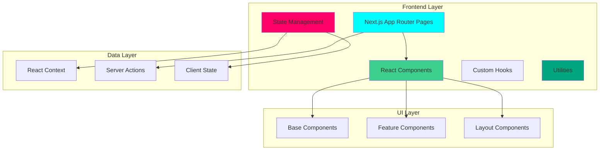

# Frontend Architecture

Complete architecture overview of ASCEND's frontend implementation using Next.js 14, React 18, and TypeScript 5.

## Architecture Overview



## Tech Stack

### Framework & Libraries

| Technology | Version | Purpose |
|-------------|----------|---------|
| Next.js | 14.0 | React framework with App Router |
| React | 18+ | UI library |
| TypeScript | 5.0+ | Type-safe JavaScript |
| Tailwind CSS | 3.4 | Utility-first styling |
| Framer Motion | 10+ | Animation library |
| Lucide React | Latest | Icon library |
| Zod | Latest | Schema validation |

### Key Decisions

1. **Server-First Architecture**: Use Server Components by default
2. **Type Safety**: Strict TypeScript with zero `any` types
3. **State Management**: React Context for global state, local state for components
4. **Server Actions**: Use Server Actions for all mutations
5. **Optimization**: Code splitting, image optimization, dynamic imports

---

## Directory Structure

```
app/
├── page.tsx                           # Landing page
├── globals.css                         # Global styles
├── layout.tsx                          # Root layout
├── (auth)/
│   ├── layout.tsx                      # Auth layout
│   └── page.tsx                       # Login/signup
├── onboarding/
│   ├── layout.tsx                      # Onboarding layout
│   └── page.tsx                       # 4-step wizard
├── dashboard/
│   ├── layout.tsx                      # Dashboard layout
│   ├── page.tsx                       # Main hub
│   ├── quest/[id]/page.tsx            # Active quest
│   ├── leaderboard/page.tsx              # Rankings
│   └── profile/page.tsx               # User profile
├── profile/[username]/page.tsx           # Public profile
├── settings/
│   └── page.tsx                       # Settings
└── help/
    ├── page.tsx                       # Help center
    ├── ui-ux/page.tsx                # UI/UX guide
    ├── features/page.tsx               # Features
    ├── faq/page.tsx                   # FAQ
    ├── demo-accounts/page.tsx          # Demo accounts
    ├── getting-started/page.tsx         # Getting started
    └── opik/page.tsx                # Opik transparency

components/
├── ui/                                # Base components
│   ├── Button.tsx
│   ├── Input.tsx
│   ├── Card.tsx
│   └── Badge.tsx
├── quest/                              # Quest-related
│   ├── QuestCard.tsx
│   ├── ExerciseList.tsx
│   └── QuestDetail.tsx
├── gamification/                        # XP, Rank, Stats
│   ├── XPBadge.tsx
│   ├── RankBadge.tsx
│   └── StatCard.tsx
├── profile/                             # Profile components
│   ├── MatchHistory.tsx
│   ├── AchievementBadge.tsx
│   └── HunterStatusBadge.tsx
└── layout/                              # Layout components
    ├── SystemNavbar.tsx
    ├── MobileSystemNavbar.tsx
    └── StravaMobileNav.tsx
```

---

## Component Architecture

### Base Components

Reusable UI components with glassmorphism design:

#### Button Component
```tsx
import { ButtonHTMLAttributes } from "react";
import { cn } from "@/lib/utils/cn";

interface ButtonProps extends ButtonHTMLAttributes<HTMLButtonElement> {
  variant?: "primary" | "secondary" | "ghost";
  size?: "sm" | "md" | "lg";
}

export function Button({ variant = "primary", size = "md", className, ...props }: ButtonProps) {
  return (
    <button
      className={cn(
        "rounded-lg font-bold transition-all",
        {
          primary: "bg-system-cyan text-void-deep hover:bg-system-cyan/90",
          secondary: "bg-white/5 text-white border border-white/10 hover:bg-white/10",
          ghost: "text-white/70 hover:text-white hover:bg-white/5",
        }[variant],
        {
          sm: "px-3 py-2 text-sm min-h-[36px]",
          md: "px-4 py-3 text-base min-h-[44px]",
          lg: "px-6 py-4 text-lg min-h-[52px]",
        }[size],
      },
      className
      )}
      {...props}
    />
  );
}
```

#### Card Component
```tsx
import { ReactNode } from "react";
import { cn } from "@/lib/utils/cn";

interface CardProps {
  children: ReactNode;
  className?: string;
  hoverable?: boolean;
}

export function Card({ children, className, hoverable = false }: CardProps) {
  return (
    <div
      className={cn(
        "bg-void-deep/50 backdrop-blur-xl border border-white/10 rounded-2xl",
        hoverable && "hover:border-system-cyan/30 hover:bg-white/5 transition-all",
        className
      )}
    >
      {children}
    </div>
  );
}
```

---

## State Management

### React Context

Global state management using React Context:

```tsx
// context/UserContext.tsx
"use client";

import { createContext, useContext, ReactNode } from "react";

interface UserContextType {
  user: User | null;
  loading: boolean;
  refreshUser: () => Promise<void>;
}

const UserContext = createContext<UserContextType | undefined>(undefined);

export function UserProvider({ children }: { children: ReactNode }) {
  const [user, setUser] = useState<User | null>(null);
  const [loading, setLoading] = useState(true);

  const refreshUser = async () => {
    setLoading(true);
    const { data } = await supabase.auth.getUser();
    const profile = await getUserProfile(data.user?.id);
    setUser(profile);
    setLoading(false);
  };

  return (
    <UserContext.Provider value={{ user, loading, refreshUser }}>
      {children}
    </UserContext.Provider>
  );
}

export function useUser() {
  const context = useContext(UserContext);
  if (context === undefined) {
    throw new Error("useUser must be used within UserProvider");
  }
  return context;
}
```

---

## Server Actions

All mutations use Server Actions for performance and type safety:

```tsx
// server/actions/quest-actions.ts
"use server";

import { createClient } from "@/lib/supabase/server";
import { revalidatePath } from "next/cache";

export async function generateQuestAction() {
  const supabase = createClient();
  const { data: { user } } = await supabase.auth.getUser();

  if (!user) {
    return { error: "Not authenticated" };
  }

  // Generate quest logic
  const quest = await generateQuest(user.id);

  // Revalidate dashboard to show new quest
  revalidatePath("/dashboard");

  return { success: true, quest };
}
```

---

## Performance Optimization

### Code Splitting

Next.js automatically code splits by route. Additional splitting for dynamic imports:

```tsx
import dynamic from "next/dynamic";

// Lazy load heavy components
const QuestDetail = dynamic(() => import("@/components/quest/QuestDetail"), {
  loading: () => <Skeleton />,
  ssr: false,
});
```

### Image Optimization

Using Next.js Image component for automatic optimization:

```tsx
import Image from "next/image";

<Image
  src="/quest-banner.png"
  alt="Quest Banner"
  width={1200}
  height={600}
  priority={true}
  className="rounded-2xl"
/>
```

---

## Design System

### Glassmorphism

Frosted glass effect with consistent styling:

```css
.glass-panel {
  background: rgba(0, 0, 0, 0.5);
  backdrop-filter: blur(24px);
  border: 1px solid rgba(255, 255, 255, 0.1);
}

.glass-card {
  background: rgba(0, 0, 0, 0.5);
  backdrop-filter: blur(24px);
  border: 1px solid rgba(255, 255, 255, 0.1);
  border-radius: 1rem;
}
```

### Colors

```typescript
export const colors = {
  primary: "#00FFFF", // system-cyan
  background: "#0A0A0F", // void-deep
  surface: "rgba(0, 0, 0, 0.5)", // glass-panel
  border: "rgba(255, 255, 255, 0.1)",
  text: "#FFFFFF",
  textMuted: "rgba(255, 255, 255, 0.6)",
};
```

---

## Animations

Using Framer Motion for smooth transitions:

```tsx
import { motion } from "framer-motion";

<motion.div
  initial={{ opacity: 0, y: 20 }}
  animate={{ opacity: 1, y: 0 }}
  transition={{ duration: 0.3 }}
>
  <Card>Content</Card>
</motion.div>
```

---

## Key Takeaways

### What Judges Should Know

1. **Server-First**: Server Components by default for better performance
2. **Type Safety**: Strict TypeScript with comprehensive interfaces
3. **State Management**: React Context for global state
4. **Server Actions**: All mutations use Server Actions
5. **Performance**: Code splitting, image optimization, dynamic imports
6. **Design System**: Consistent glassmorphism design
7. **Animations**: Framer Motion for smooth transitions

### Evidence of Robust Implementation

- ✅ Complete directory structure documented
- ✅ Component architecture with code examples
- ✅ State management with React Context
- ✅ Server Actions for all mutations
- ✅ Performance optimization strategies
- ✅ Design system with glassmorphism
- ✅ Animation library integration
- ✅ TypeScript strict mode enabled

---

*Last Updated: February 5, 2026*
