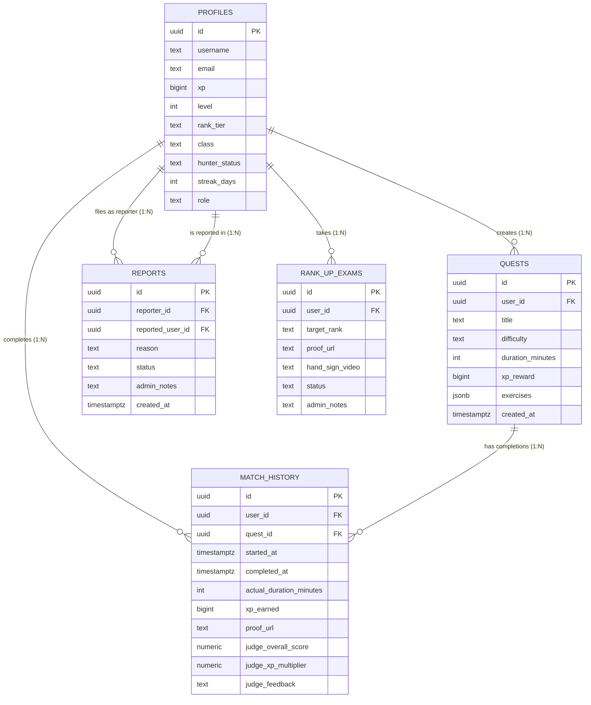

# Database Relationships

> Entity-relationship design and foreign key architecture

---

## Relationship Overview

ASCEND: FITNESS RPG uses a relational database model with clear foreign key relationships and cascade rules.

| Relationship | Type | Table A | Table B | Cascade |
|--------------|------|---------|---------|---------|
| User → Quests | One-to-Many | `profiles` | `quests` | DELETE CASCADE |
| User → Match History | One-to-Many | `profiles` | `match_history` | DELETE CASCADE |
| Quest → Match History | One-to-Many | `quests` | `match_history` | DELETE CASCADE |
| User → Reports (Reporter) | One-to-Many | `profiles` | `reports` | DELETE CASCADE |
| User → Reports (Reported) | One-to-Many | `profiles` | `reports` | DELETE CASCADE |
| User → Rank-Up Exams | One-to-Many | `profiles` | `rank_up_exams` | DELETE CASCADE |

---

## Visual ER Diagram



---

## Detailed Relationships

### 1. User to Quests (One-to-Many)

A user can create multiple quests. When a user is deleted, all their quests are automatically deleted.

**Schema Definition:**

```sql
ALTER TABLE public.quests
ADD CONSTRAINT fk_quests_user_id 
FOREIGN KEY (user_id) 
REFERENCES public.profiles(id) 
ON DELETE CASCADE;
```

**TypeScript Interface:**

```typescript
interface Profile {
  id: string;
  username: string;
  quests?: Quest[]; // One user has many quests
}

interface Quest {
  id: string;
  user_id: string; // Foreign key to profiles
  title: string;
  difficulty: 'E' | 'D' | 'C' | 'B' | 'A' | 'S';
}
```

**Query Example:**

```typescript
import { createClient } from '@/lib/supabase/server';

// Get user with all their quests
async function getUserWithQuests(userId: string) {
  const supabase = createClient();
  
  const { data, error } = await supabase
    .from('profiles')
    .select(`
      *,
      quests:quests(
        id,
        title,
        difficulty,
        xp_reward,
        duration_minutes,
        created_at
      )
    `)
    .eq('id', userId)
    .single();

  if (error) throw error;
  return data;
}
```

**Result Structure:**

```typescript
{
  id: "uuid-1",
  username: "ShadowHunter",
  xp: 15000,
  quests: [
    {
      id: "quest-1",
      title: "Gatekeeper Protocol",
      difficulty: "B",
      xp_reward: 500,
      duration_minutes: 45
    },
    {
      id: "quest-2",
      title: "Dungeon Raid: Core",
      difficulty: "A",
      xp_reward: 1200,
      duration_minutes: 60
    }
  ]
}
```

---

### 2. User to Match History (One-to-Many)

A user can complete quests multiple times. Each completion is recorded as a match history entry.

**Schema Definition:**

```sql
ALTER TABLE public.match_history
ADD CONSTRAINT fk_match_history_user_id 
FOREIGN KEY (user_id) 
REFERENCES public.profiles(id) 
ON DELETE CASCADE;
```

**TypeScript Interface:**

```typescript
interface Profile {
  id: string;
  username: string;
  match_history?: MatchHistory[]; // One user has many completions
}

interface MatchHistory {
  id: string;
  user_id: string; // Foreign key to profiles
  quest_id: string;
  xp_earned: bigint;
  judge_overall_score: number;
  completed_at: Date;
}
```

**Query Example:**

```typescript
// Get user's complete match history
async function getUserMatchHistory(userId: string, limit = 50) {
  const supabase = createClient();
  
  const { data, error } = await supabase
    .from('profiles')
    .select(`
      *,
      match_history:match_history(
        id,
        quest_id,
        started_at,
        completed_at,
        xp_earned,
        judge_overall_score,
        judge_xp_multiplier,
        proof_url
      )
    `)
    .eq('id', userId)
    .single();

  if (error) throw error;
  
  // Sort by completion date
  return data.match_history.sort(
    (a, b) => new Date(b.completed_at).getTime() - new Date(a.completed_at).getTime()
  );
}
```

---

### 3. Quest to Match History (One-to-Many)

A single quest can be completed multiple times by different users (or the same user).

**Schema Definition:**

```sql
ALTER TABLE public.match_history
ADD CONSTRAINT fk_match_history_quest_id 
FOREIGN KEY (quest_id) 
REFERENCES public.quests(id) 
ON DELETE CASCADE;
```

**Query Example:**

```typescript
// Get all completions for a specific quest
async function getQuestCompletions(questId: string) {
  const supabase = createClient();
  
  const { data, error } = await supabase
    .from('match_history')
    .select(`
      *,
      profiles!inner(
        username,
        rank_tier,
        level
      )
    `)
    .eq('quest_id', questId)
    .order('completed_at', { ascending: false });

  if (error) throw error;
  return data;
}

// Get match history with quest details
async function getMatchHistoryWithQuests(userId: string) {
  const supabase = createClient();
  
  const { data, error } = await supabase
    .from('match_history')
    .select(`
      *,
      quest:quests!inner(
        title,
        difficulty,
        xp_reward
      )
    `)
    .eq('user_id', userId)
    .order('completed_at', { ascending: false })
    .limit(20);

  if (error) throw error;
  return data;
}
```

---

### 4. User to Reports (One-to-Many)

Users can file reports against other users. The `reports` table has two foreign keys to `profiles`.

**Schema Definition:**

```sql
ALTER TABLE public.reports
ADD CONSTRAINT fk_reports_reporter_id 
FOREIGN KEY (reporter_id) 
REFERENCES public.profiles(id) 
ON DELETE CASCADE;

ALTER TABLE public.reports
ADD CONSTRAINT fk_reports_reported_user_id 
FOREIGN KEY (reported_user_id) 
REFERENCES public.profiles(id) 
ON DELETE CASCADE;
```

**TypeScript Interface:**

```typescript
interface Profile {
  id: string;
  username: string;
  reports_filed?: Report[]; // Reports this user filed
  reports_received?: Report[]; // Reports against this user
}

interface Report {
  id: string;
  reporter_id: string; // Foreign key to profiles
  reported_user_id: string; // Foreign key to profiles
  reason: string;
  status: 'pending' | 'investigating' | 'resolved' | 'dismissed';
}
```

**Query Example:**

```typescript
// Get all reports filed by a user
async function getUserReportsFiled(userId: string) {
  const supabase = createClient();
  
  const { data, error } = await supabase
    .from('profiles')
    .select(`
      username,
      reports_filed:reports!reporter_id(
        id,
        reason,
        status,
        created_at,
        reported_user:profiles!reported_user_id(
          username
        )
      )
    `)
    .eq('id', userId)
    .single();

  if (error) throw error;
  return data;
}

// Get all reports against a user
async function getUserReportsReceived(userId: string) {
  const supabase = createClient();
  
  const { data, error } = await supabase
    .from('reports')
    .select(`
      *,
      reporter:profiles!reporter_id(
        username
      )
    `)
    .eq('reported_user_id', userId)
    .order('created_at', { ascending: false });

  if (error) throw error;
  return data;
}
```

---

### 5. User to Rank-Up Exams (One-to-Many)

Users can take multiple rank-up exams to progress through hunter ranks.

**Schema Definition:**

```sql
ALTER TABLE public.rank_up_exams
ADD CONSTRAINT fk_rank_up_exams_user_id 
FOREIGN KEY (user_id) 
REFERENCES public.profiles(id) 
ON DELETE CASCADE;
```

**Query Example:**

```typescript
// Get user's rank-up exam history
async function getUserRankUpExams(userId: string) {
  const supabase = createClient();
  
  const { data, error } = await supabase
    .from('rank_up_exams')
    .select('*')
    .eq('user_id', userId)
    .order('created_at', { ascending: false });

  if (error) throw error;
  return data;
}

// Get pending rank-up exams (admin view)
async function getPendingRankUpExams() {
  const supabase = createClient();
  
  const { data, error } = await supabase
    .from('rank_up_exams')
    .select(`
      *,
      user:profiles!inner(
        username,
        current_rank:rank_tier,
        level
      )
    `)
    .eq('status', 'pending')
    .order('created_at', { ascending: false });

  if (error) throw error;
  return data;
}
```

---

## Cascade Rules

### ON DELETE CASCADE

When a user is deleted, all related records are automatically deleted:

| Child Table | Behavior |
|-------------|----------|
| `quests` | All quests created by user are deleted |
| `match_history` | All quest completions are deleted |
| `reports` | All reports (filed and received) are deleted |
| `rank_up_exams` | All rank-up exam requests are deleted |

**Example:**

```sql
-- Deleting a user cascades to all related data
DELETE FROM profiles 
WHERE id = 'user-uuid-123';

-- Automatically deletes:
-- - All quests where user_id = 'user-uuid-123'
-- - All match_history where user_id = 'user-uuid-123'
-- - All reports where reporter_id OR reported_user_id = 'user-uuid-123'
-- - All rank_up_exams where user_id = 'user-uuid-123'
```

### Cascade Benefits

1. **Data Integrity:** Ensures no orphan records remain
2. **Automatic Cleanup:** No manual cleanup required
3. **Storage Efficiency:** Removes unnecessary data
4. **Privacy Compliance:** Supports GDPR "right to be forgotten"

---

## Complex Query Examples

### Public Match History Feed

Get recent completions across all users (social feed):

```typescript
async function getPublicMatchHistory(limit = 50) {
  const supabase = createClient();
  
  const { data, error } = await supabase
    .from('match_history')
    .select(`
      *,
      user:profiles!inner(
        username,
        rank_tier,
        level,
        class,
        avatar_url
      ),
      quest:quests!inner(
        title,
        difficulty,
        xp_reward
      )
    `)
    .not('user.hunter_status', 'eq', 'Corrupted')
    .order('completed_at', { ascending: false })
    .limit(limit);

  if (error) throw error;
  return data;
}
```

### Leaderboard with Quest Stats

Get top users with their quest completion statistics:

```typescript
async function getLeaderboard(limit = 100) {
  const supabase = createClient();
  
  const { data, error } = await supabase
    .from('profiles')
    .select(`
      username,
      rank_tier,
      level,
      xp,
      streak_days,
      total_quests,
      total_xp_earned,
      match_history:match_history(count),
      quests:quests(count)
    `)
    .eq('hunter_status', 'Normal')
    .order('xp', { ascending: false })
    .limit(limit);

  if (error) throw error;
  return data;
}
```

### User Activity Summary

Get complete user profile with all relationships:

```typescript
async function getUserActivitySummary(userId: string) {
  const supabase = createClient();
  
  const { data, error } = await supabase
    .from('profiles')
    .select(`
      *,
      quests:quests(
        id,
        title,
        difficulty,
        xp_reward,
        created_at
      ),
      match_history:match_history(
        *,
        quest:quests!inner(
          title,
          difficulty
        )
      ),
      reports_filed:reports!reporter_id(
        id,
        reason,
        status
      ),
      reports_received:reports!reported_user_id(
        id,
        reason,
        status
      ),
      rank_up_exams:rank_up_exams(
        id,
        target_rank,
        status
      )
    `)
    .eq('id', userId)
    .single();

  if (error) throw error;
  return data;
}
```

---

## Relationship Integrity

### Foreign Key Constraints

All foreign keys are enforced at the database level:

```sql
-- Prevents inserting match_history with non-existent user
INSERT INTO match_history (user_id, quest_id, started_at)
VALUES ('invalid-user-id', 'valid-quest-id', NOW());
-- ERROR: insert or update on table "match_history" violates foreign key constraint

-- Prevents deleting user who has quests (if CASCADE not enabled)
DELETE FROM profiles WHERE id = 'user-with-quests';
-- ERROR: update or delete on table "profiles" violates foreign key constraint
```

### Referential Actions

| Action | profiles | quests | match_history | reports | rank_up_exams |
|--------|----------|--------|---------------|---------|---------------|
| `ON DELETE CASCADE` | ✅ | ✅ | ✅ | ✅ | ✅ |
| `ON UPDATE CASCADE` | ❌ | ❌ | ❌ | ❌ | ❌ |

**Note:** Primary keys (UUIDs) are immutable, so `ON UPDATE CASCADE` is not needed.

---

*Last Updated: February 5, 2026*
