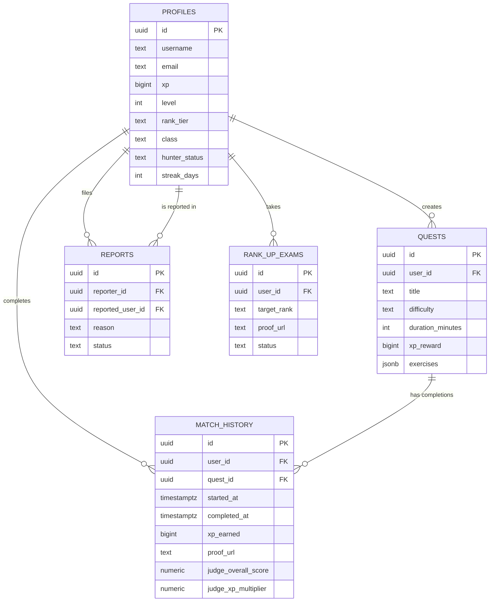

# Database Schema

> Complete database architecture for ASCEND: FITNESS RPG

---

## Table Overview

| Table | Purpose | Primary Key | Relationships | Est. Rows |
|-------|---------|-------------|---------------|-----------|
| `profiles` | User accounts, XP, rank, stats | `id` (UUID) | Has many quests, match history, reports, rank-up exams | 1,000+ |
| `quests` | Generated workout quests | `id` (UUID) | Belongs to profile, has many completions | 5,000+ |
| `match_history` | Quest completions with scores | `id` (UUID) | Belongs to profile and quest | 50,000+ |
| `reports` | Community moderation reports | `id` (UUID) | Reporter and reported user (both profiles) | 500+ |
| `rank_up_exams` | Rank promotion requests | `id` (UUID) | Belongs to profile | 200+ |

---

## Table Definitions

### profiles Table

**Purpose:** Stores user account data, progression (XP, level, rank), and social information.

```sql
CREATE TABLE public.profiles (
  id UUID PRIMARY KEY DEFAULT gen_random_uuid(),
  username TEXT UNIQUE NOT NULL,
  email TEXT UNIQUE NOT NULL,
  password_hash TEXT NOT NULL,
  created_at TIMESTAMPTZ DEFAULT NOW(),
  updated_at TIMESTAMPTZ DEFAULT NOW(),
  xp BIGINT DEFAULT 0,
  level INT DEFAULT 1,
  rank_tier TEXT DEFAULT 'E' CHECK (rank_tier IN ('E', 'D', 'C', 'B', 'A', 'S')),
  class TEXT DEFAULT 'Assassin' CHECK (class IN ('Tank', 'Striker', 'Assassin')),
  role TEXT DEFAULT 'user' CHECK (role IN ('user', 'admin')),
  avatar_url TEXT,
  bio TEXT,
  goals TEXT[],
  equipment TEXT[],
  hunter_status TEXT DEFAULT 'Normal' CHECK (hunter_status IN ('Normal', 'Verified', 'Flagged', 'Corrupted')),
  streak_days INT DEFAULT 0,
  longest_streak INT DEFAULT 0,
  total_quests INT DEFAULT 0,
  total_xp_earned BIGINT DEFAULT 0,
  
  CONSTRAINT xp_min CHECK (xp >= 0),
  CONSTRAINT level_min CHECK (level >= 1),
  CONSTRAINT streak_min CHECK (streak_days >= 0)
);
```

**Indexes:**

```sql
CREATE INDEX idx_profiles_username ON public.profiles(username);
CREATE INDEX idx_profiles_xp ON public.profiles(xp DESC);
CREATE INDEX idx_profiles_level ON public.profiles(level DESC);
CREATE INDEX idx_profiles_rank_tier ON public.profiles(rank_tier);
CREATE INDEX idx_profiles_hunter_status ON public.profiles(hunter_status);
```

**Column Descriptions:**

| Column | Type | Description | Constraints |
|--------|------|-------------|-------------|
| `id` | UUID | Unique user identifier | Primary key |
| `username` | TEXT | Display username | Unique, required |
| `email` | TEXT | User email | Unique, required |
| `password_hash` | TEXT | Bcrypt hashed password | Required |
| `xp` | BIGINT | Current experience points | ≥ 0 |
| `level` | INT | Current hunter level | ≥ 1 |
| `rank_tier` | TEXT | Hunter rank (E-S) | E, D, C, B, A, S |
| `class` | TEXT | Hunter class | Tank, Striker, Assassin |
| `role` | TEXT | User permission | user, admin |
| `hunter_status` | TEXT | Anti-cheat status | Normal, Verified, Flagged, Corrupted |
| `streak_days` | INT | Current workout streak | ≥ 0 |
| `goals` | TEXT[] | Fitness goals array | - |
| `equipment` | TEXT[] | Available equipment | - |

---

### quests Table

**Purpose:** Stores AI-generated workout quests with exercises and difficulty.

```sql
CREATE TABLE public.quests (
  id UUID PRIMARY KEY DEFAULT gen_random_uuid(),
  title TEXT NOT NULL,
  description TEXT,
  difficulty TEXT NOT NULL CHECK (difficulty IN ('E', 'D', 'C', 'B', 'A', 'S')),
  duration_minutes INT NOT NULL CHECK (duration_minutes > 0),
  xp_reward BIGINT NOT NULL CHECK (xp_reward >= 0),
  exercises JSONB NOT NULL,
  warm_up JSONB,
  cool_down JSONB,
  class_specialization JSONB,
  created_at TIMESTAMPTZ DEFAULT NOW(),
  user_id UUID REFERENCES public.profiles(id) ON DELETE CASCADE,
  
  CONSTRAINT xp_reward_min CHECK (xp_reward >= 50),
  CONSTRAINT xp_reward_max CHECK (xp_reward <= 4000),
  CONSTRAINT duration_min CHECK (duration_minutes >= 15),
  CONSTRAINT duration_max CHECK (duration_minutes <= 180)
);
```

**Indexes:**

```sql
CREATE INDEX idx_quests_user_id ON public.quests(user_id);
CREATE INDEX idx_quests_difficulty ON public.quests(difficulty);
CREATE INDEX idx_quests_created_at ON public.quests(created_at DESC);
```

**Column Descriptions:**

| Column | Type | Description | Constraints |
|--------|------|-------------|-------------|
| `id` | UUID | Unique quest identifier | Primary key |
| `title` | TEXT | Quest name | Required |
| `description` | TEXT | Quest narrative | - |
| `difficulty` | TEXT | Quest difficulty | E, D, C, B, A, S |
| `duration_minutes` | INT | Expected duration | 15-180 min |
| `xp_reward` | BIGINT | Base XP reward | 50-4000 XP |
| `exercises` | JSONB | Exercise list | Required |
| `warm_up` | JSONB | Warm-up routine | Optional |
| `cool_down` | JSONB | Cool-down routine | Optional |
| `class_specialization` | JSONB | Class-specific mods | Optional |
| `user_id` | UUID | Quest creator | FK to profiles |

**Exercises JSONB Structure:**

```typescript
interface Exercise {
  name: string;
  type: 'reps' | 'timed' | 'distance';
  sets: number;
  value: number; // reps or seconds
  target_muscle: string[];
  instructions: string[];
}
```

---

### match_history Table

**Purpose:** Records quest completions with AI judge scores and proof.

```sql
CREATE TABLE public.match_history (
  id UUID PRIMARY KEY DEFAULT gen_random_uuid(),
  user_id UUID REFERENCES public.profiles(id) ON DELETE CASCADE,
  quest_id UUID REFERENCES public.quests(id) ON DELETE CASCADE,
  started_at TIMESTAMPTZ NOT NULL,
  completed_at TIMESTAMPTZ,
  actual_duration_minutes INT CHECK (actual_duration_minutes > 0),
  xp_earned BIGINT CHECK (xp_earned >= 0),
  proof_url TEXT,
  notes TEXT,
  judge_form_score NUMERIC(3, 2) CHECK (judge_form_score >= 0 AND judge_form_score <= 1),
  judge_effort_score NUMERIC(3, 2) CHECK (judge_effort_score >= 0 AND judge_effort_score <= 1),
  judge_consistency_score NUMERIC(3, 2) CHECK (judge_consistency_score >= 0 AND judge_consistency_score <= 1),
  judge_overall_score NUMERIC(3, 2) CHECK (judge_overall_score >= 0 AND judge_overall_score <= 1),
  judge_xp_multiplier NUMERIC(3, 2) CHECK (judge_xp_multiplier >= 0 AND judge_xp_multiplier <= 1.5),
  judge_feedback TEXT,
  judge_suggested_improvements TEXT[],
  created_at TIMESTAMPTZ DEFAULT NOW(),
  
  CONSTRAINT xp_earned_min CHECK (xp_earned >= 0),
  CONSTRAINT duration_min CHECK (actual_duration_minutes >= 5),
  CONSTRAINT scores_min CHECK (judge_form_score >= 0 AND judge_effort_score >= 0 AND judge_consistency_score >= 0),
  CONSTRAINT scores_max CHECK (judge_form_score <= 1 AND judge_effort_score <= 1 AND judge_consistency_score <= 1),
  CONSTRAINT multiplier_min CHECK (judge_xp_multiplier >= 0.8),
  CONSTRAINT multiplier_max CHECK (judge_xp_multiplier <= 1.5)
);
```

**Indexes:**

```sql
CREATE INDEX idx_match_history_user_id ON public.match_history(user_id);
CREATE INDEX idx_match_history_completed_at ON public.match_history(completed_at DESC);
CREATE INDEX idx_match_history_quest_id ON public.match_history(quest_id);
CREATE INDEX idx_match_history_xp_earned ON public.match_history(xp_earned DESC);
```

**Column Descriptions:**

| Column | Type | Description | Constraints |
|--------|------|-------------|-------------|
| `id` | UUID | Unique record ID | Primary key |
| `user_id` | UUID | User who completed | FK to profiles |
| `quest_id` | UUID | Quest completed | FK to quests |
| `started_at` | TIMESTAMPTZ | Quest start time | Required |
| `completed_at` | TIMESTAMPTZ | Quest completion | Optional |
| `actual_duration_minutes` | INT | Actual workout time | ≥ 5 min |
| `xp_earned` | BIGINT | Final XP awarded | ≥ 0 |
| `proof_url` | TEXT | Video/picture proof | Optional |
| `judge_form_score` | NUMERIC(3,2) | AI form score (0-1) | 0-1 |
| `judge_effort_score` | NUMERIC(3,2) | AI effort score (0-1) | 0-1 |
| `judge_consistency_score` | NUMERIC(3,2) | AI consistency (0-1) | 0-1 |
| `judge_overall_score` | NUMERIC(3,2) | Combined score (0-1) | 0-1 |
| `judge_xp_multiplier` | NUMERIC(3,2) | XP multiplier | 0.8-1.5x |
| `judge_feedback` | TEXT | AI judge feedback | - |
| `judge_suggested_improvements` | TEXT[] | AI suggestions | - |

---

### reports Table

**Purpose:** Community moderation system for flagging suspicious activity.

```sql
CREATE TABLE public.reports (
  id UUID PRIMARY KEY DEFAULT gen_random_uuid(),
  reporter_id UUID REFERENCES public.profiles(id) ON DELETE CASCADE NOT NULL,
  reported_user_id UUID REFERENCES public.profiles(id) ON DELETE CASCADE NOT NULL,
  reason TEXT NOT NULL,
  status TEXT DEFAULT 'pending' CHECK (status IN ('pending', 'investigating', 'resolved', 'dismissed')),
  admin_notes TEXT,
  created_at TIMESTAMPTZ DEFAULT NOW(),
  resolved_at TIMESTAMPTZ,
  
  CONSTRAINT reporter_required CHECK (reporter_id IS NOT NULL),
  CONSTRAINT status_default CHECK (status = 'pending')
);
```

**Indexes:**

```sql
CREATE INDEX idx_reports_reporter_id ON public.reports(reporter_id);
CREATE INDEX idx_reports_status ON public.reports(status);
CREATE INDEX idx_reports_reported_user_id ON public.reports(reported_user_id);
```

**Column Descriptions:**

| Column | Type | Description | Constraints |
|--------|------|-------------|-------------|
| `id` | UUID | Unique report ID | Primary key |
| `reporter_id` | UUID | User filing report | FK to profiles |
| `reported_user_id` | UUID | User being reported | FK to profiles |
| `reason` | TEXT | Report reason | Required |
| `status` | TEXT | Moderation status | pending, investigating, resolved, dismissed |
| `admin_notes` | TEXT | Admin comments | - |
| `created_at` | TIMESTAMPTZ | Report timestamp | Auto |
| `resolved_at` | TIMESTAMPTZ | Resolution timestamp | - |

---

### rank_up_exams Table

**Purpose:** Stores rank promotion requests with video proof verification.

```sql
CREATE TABLE public.rank_up_exams (
  id UUID PRIMARY KEY DEFAULT gen_random_uuid(),
  user_id UUID REFERENCES public.profiles(id) ON DELETE CASCADE NOT NULL,
  target_rank TEXT NOT NULL CHECK (target_rank IN ('D', 'C', 'B', 'A', 'S')),
  proof_url TEXT NOT NULL,
  hand_sign_video TEXT,
  status TEXT DEFAULT 'pending' CHECK (status IN ('pending', 'submitted', 'under_review', 'approved', 'rejected')),
  admin_notes TEXT,
  created_at TIMESTAMPTZ DEFAULT NOW(),
  reviewed_at TIMESTAMPTZ,
  
  CONSTRAINT user_required CHECK (user_id IS NOT NULL),
  CONSTRAINT target_rank_required CHECK (target_rank IS NOT NULL),
  CONSTRAINT status_default CHECK (status = 'pending')
);
```

**Indexes:**

```sql
CREATE INDEX idx_rank_up_exams_user_id ON public.rank_up_exams(user_id);
CREATE INDEX idx_rank_up_exams_status ON public.rank_up_exams(status);
CREATE INDEX idx_rank_up_exams_target_rank ON public.rank_up_exams(target_rank);
```

**Column Descriptions:**

| Column | Type | Description | Constraints |
|--------|------|-------------|-------------|
| `id` | UUID | Unique exam ID | Primary key |
| `user_id` | UUID | User taking exam | FK to profiles |
| `target_rank` | TEXT | Rank to achieve | D, C, B, A, S |
| `proof_url` | TEXT | Video proof URL | Required |
| `hand_sign_video` | TEXT | Hand sign video | Optional |
| `status` | TEXT | Exam status | pending, submitted, under_review, approved, rejected |
| `admin_notes` | TEXT | Admin comments | - |
| `created_at` | TIMESTAMPTZ | Request timestamp | Auto |
| `reviewed_at` | TIMESTAMPTZ | Review timestamp | - |

---

## ER Diagram



---

## Indexes and Performance

### Index Summary

| Table | Index | Purpose | Type |
|-------|-------|---------|------|
| `profiles` | `idx_profiles_username` | Fast username lookup | B-tree |
| `profiles` | `idx_profiles_xp` | Leaderboard queries | B-tree DESC |
| `profiles` | `idx_profiles_level` | Level-based filtering | B-tree DESC |
| `profiles` | `idx_profiles_rank_tier` | Rank-based filtering | B-tree |
| `profiles` | `idx_profiles_hunter_status` | Anti-cheat filtering | B-tree |
| `quests` | `idx_quests_user_id` | User quest history | B-tree |
| `quests` | `idx_quests_difficulty` | Difficulty filtering | B-tree |
| `quests` | `idx_quests_created_at` | Recent quests | B-tree DESC |
| `match_history` | `idx_match_history_user_id` | User completions | B-tree |
| `match_history` | `idx_match_history_completed_at` | Timeline queries | B-tree DESC |
| `match_history` | `idx_match_history_quest_id` | Quest statistics | B-tree |
| `match_history` | `idx_match_history_xp_earned` | High scores | B-tree DESC |
| `reports` | `idx_reports_reporter_id` | User reports | B-tree |
| `reports` | `idx_reports_status` | Admin filtering | B-tree |
| `reports` | `idx_reports_reported_user_id` | User reputation | B-tree |
| `rank_up_exams` | `idx_rank_up_exams_user_id` | User exam history | B-tree |
| `rank_up_exams` | `idx_rank_up_exams_status` | Admin filtering | B-tree |
| `rank_up_exams` | `idx_rank_up_exams_target_rank` | Rank statistics | B-tree |

### Query Optimization Strategies

1. **Leaderboard Queries:**
   ```sql
   -- Efficient: Uses idx_profiles_xp DESC
   SELECT username, xp, level, rank_tier
   FROM profiles
   WHERE hunter_status != 'Corrupted'
   ORDER BY xp DESC
   LIMIT 100;
   ```

2. **User Match History:**
   ```sql
   -- Efficient: Uses idx_match_history_user_id + idx_match_history_completed_at
   SELECT mh.*, q.title, q.difficulty
   FROM match_history mh
   JOIN quests q ON mh.quest_id = q.id
   WHERE mh.user_id = $1
   ORDER BY mh.completed_at DESC;
   ```

3. **Recent Public Feed:**
   ```sql
   -- Efficient: Uses idx_match_history_completed_at
   SELECT mh.*, p.username, q.title
   FROM match_history mh
   JOIN profiles p ON mh.user_id = p.id
   JOIN quests q ON mh.quest_id = q.id
   ORDER BY mh.completed_at DESC
   LIMIT 50;
   ```

### Row Count Estimates

| Table | Users | 3 Months | 6 Months | 1 Year |
|-------|-------|----------|----------|--------|
| `profiles` | 1,000 | 2,000 | 3,000 | 5,000 |
| `quests` | 5,000 | 15,000 | 30,000 | 60,000 |
| `match_history` | 50,000 | 150,000 | 300,000 | 600,000 |
| `reports` | 500 | 1,500 | 3,000 | 6,000 |
| `rank_up_exams` | 200 | 600 | 1,200 | 2,400 |

---

## Database Triggers

### XP Update Validation Trigger

```sql
CREATE OR REPLACE FUNCTION check_xp_update()
RETURNS TRIGGER AS $$
BEGIN
  -- Prevent impossible XP jumps (max 4000 per quest)
  IF NEW.xp - OLD.xp > 4000 THEN
    RAISE EXCEPTION 'Invalid XP increase: % to %', OLD.xp, NEW.xp
    USING ERRCODE = '23505';
  END IF;
  
  RETURN NEW;
END;
$$ LANGUAGE plpgsql;

CREATE TRIGGER enforce_xp_limits
BEFORE UPDATE OF xp ON profiles
FOR EACH ROW EXECUTE FUNCTION check_xp_update();
```

### Streak Update Trigger

```sql
CREATE OR REPLACE FUNCTION update_streak()
RETURNS TRIGGER AS $$
BEGIN
  -- Update streak if quest completed within 24 hours
  IF NEW.completed_at IS NOT NULL THEN
    UPDATE profiles
    SET streak_days = streak_days + 1,
        longest_streak = GREATEST(longest_streak, streak_days + 1),
        total_quests = total_quests + 1,
        total_xp_earned = total_xp_earned + NEW.xp_earned
    WHERE id = NEW.user_id;
  END IF;
  
  RETURN NEW;
END;
$$ LANGUAGE plpgsql;

CREATE TRIGGER update_user_streak
AFTER INSERT ON match_history
FOR EACH ROW EXECUTE FUNCTION update_streak();
```

---

*Last Updated: February 5, 2026*
