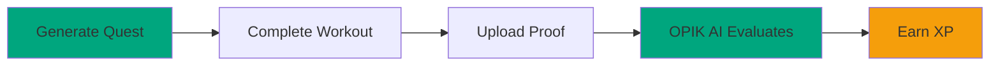

# Getting Started

## Demo Accounts

Start immediately with demo accounts at any rank level. All accounts are pre-configured with XP, levels, and unlocked features.

| Rank | Email | Password | Level | XP |
|-------|--------|-----------|--------|-----|
| S | shadowhunter@test.com | Test123! | 95 | 245,000 |
| A | thunderstrike@test.com | Test123! | 78 | 156,000 |
| B | swiftwolf@test.com | Test123! | 52 | 104,000 |
| C | swiftninja@test.com | Test123! | 22 | 44,000 |

[View all 40 demo accounts](./demo-accounts.md)

## Quest Completion Flow

## Hunter Ranks

| Rank | Level | XP Range | Features |
|-------|--------|-----------|-----------|
| E | 1-9 | 0-1,500 | Bodyweight quests |
| D | 10-19 | 1,500-5,000 | Equipment workouts |
| C | 20-29 | 5,000-12,000 | Intermediate exercises |
| B | 30-39 | 12,000-25,000 | Advanced multi-exercise |
| A | 40-49 | 25,000-45,000 | High-intensity |
| S | 50+ | 45,000+ | Elite quests |

[Demo Accounts](./demo-accounts.md) • [First Quest Guide](./how-to-complete-your-first-quest.md) • [Rank Details](./understanding-the-hunter-ranking-system.md)

---

*Last Updated: February 10, 2026*
