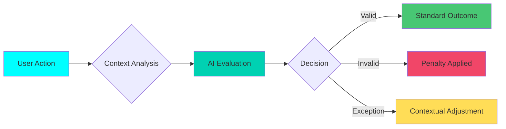

# Opik AI Flow Diagrams

Visual representations of how Opik AI processes different workout scenarios and user reports.

## Overview

These flow diagrams illustrate the various scenarios where Opik AI's LLM-as-a-Judge technology evaluates user interactions, quest completions, and reports. Each diagram shows the decision-making process and outcomes based on different situations.

---

## User False Report


*User reports suspicious activity, but the report is determined to be a personal attack rather than a valid report - no penalty applied.*

**Key Points:**
- User submits a report about another hunter
- Opik AI evaluates the report's validity
- Analysis reveals the report is a personal attack
- No penalty is applied to either party
- System maintains fairness by filtering out malicious reports

**Example Trace - Report Moderation Analysis:**

**Input:**
```json
{
  "report_id": "2993a29b-b7b6-431d-8cc8-a90e9e040b6f",
  "reason": "Impossible_Stats",
  "target_user_id": "afbf86e8-043d-431d-b7ee-2787c371403d",
  "has_log_data": false
}
```

**Output:**
```json
{
  "credibility_score": 0.2,
  "severity_score": 0,
  "action": "DISMISS",
  "confidence": 0.8,
  "reasoning": "The report lacks specific details and evidence, making it seem malicious or a personal attack.",
  "xp_reduction": null,
  "status_change": null,
  "hunter_status_change": null
}
```

---

## System/Architect Judge


*System architect (Llama) evaluates user reports and provides judgment through Opik AI, ensuring consistent evaluation across all reports.*

**Key Points:**
- User reports suspicious activity or violation
- Llama AI analyzes the report context
- Opik AI provides judgment based on established criteria
- Consistent evaluation across all reports
- Ensures fairness and eliminates bias

**Example Trace - Architect Quest Generation Success:**

**Input:**
```json
{
  "user_class": "Striker",
  "user_rank": "D-Rank",
  "time_window_min": 30,
  "equipment_count": 8,
  "muscle_soreness_count": 0,
  "proof_disabled": true
}
```

**Output:**
```json
{
  "quest_name": "D-Rank Striker Protocol",
  "quest_rank": "D-Rank",
  "quest_type": "Daily",
  "exercise_count": 4,
  "xp_reward": 300,
  "estimated_duration_min": 30,
  "completion_probability": 65,
  "generation_time_ms": 1634,
  "requires_proof": false,
  "proof_type": "None"
}
```

**Example Trace - Architect Quest Generation Success (A-Rank Assassin):**

**Input:**
```json
{
  "user_class": "Assassin",
  "user_rank": "A-Rank",
  "time_window_min": 30,
  "equipment_count": 0,
  "muscle_soreness_count": 0,
  "proof_disabled": true
}
```

**Output:**
```json
{
  "quest_name": "A-Rank Viper Protocol",
  "quest_rank": "A-Rank",
  "quest_type": "Daily",
  "exercise_count": 6,
  "xp_reward": 2500,
  "estimated_duration_min": 30,
  "completion_probability": 55,
  "generation_time_ms": 1863,
  "requires_proof": false,
  "proof_type": "None"
}
```

---

## Workout Verifier (User Sick)


*User reports difficulty completing workout due to illness - fair evaluation with appropriate XP penalty applied.*

**Key Points:**
- User initiates workout quest
- User reports not feeling well during workout
- Opik AI evaluates the situation contextually
- Fair XP penalty applied (reduced rather than zero)
- Maintains user accountability while showing flexibility

---

## Workout Planner


*Llama generates workout plan, Opik AI evaluates user feedback and provides rating (7/10) for workout suitability.*

**Key Points:**
- Llama AI generates personalized workout plan
- User completes workout and provides feedback
- Opik AI evaluates workout effectiveness based on user feedback
- Rating system (e.g., 7/10) measures workout suitability
- Continuous improvement of workout recommendations

**Example Trace - Quest Generation Success (D-Rank Striker):**

**Input:**
```json
{
  "user_id": "77735844-5d29-49ea-b1ae-5d5919ddb6e0",
  "username": "Nathan123",
  "user_rank": "D-Rank",
  "user_level": 1,
  "time_window_min": 30,
  "equipment_count": 8,
  "equipment": [
    "Pull-up Bar",
    "Dumbbells",
    "Kettlebell",
    "Barbell",
    "Resistance Bands",
    "Bench",
    "Jump Rope",
    "Treadmill"
  ],
  "muscle_soreness_count": 0,
  "muscle_soreness": [],
  "feedback_patterns_count": 0,
  "top_anomalies": [],
  "quest_type": "Daily",
  "environment": "production"
}
```

**Output:**
```json
{
  "quest_name": "D-Rank Striker Protocol",
  "quest_rank": "D-Rank",
  "quest_type": "Daily",
  "quest_narrative": "You have been assigned a daily protocol to enhance your striking capabilities. This 30-minute routine is designed to push your limits and improve your overall performance...",
  "exercise_count": 4,
  "exercise_names": [
    "Jumping Rope",
    "Dumbbell Squats",
    "Kettlebell Swings",
    "Pull-ups"
  ],
  "xp_reward": 300,
  "xp_potential": 300,
  "estimated_duration_min": 30,
  "target_class": "Striker",
  "requires_proof": false,
  "proof_type": "None",
  "completion_probability": 65,
  "ai_review_reasoning": "This protocol is designed to challenge your cardiovascular endurance and muscular strength, which are essential for a Striker. The exercises are chosen to work multiple muscle groups at once, improving...",
  "ai_review_key_factors": [
    "Cardio Heavy",
    "Full Body",
    "Compound Exercises"
  ],
  "stat_gain": {
    "strength": 10,
    "agility": 15,
    "stamina": 12
  },
  "generation_time_ms": 1639,
  "generation_status": "success",
  "fallback_used": false
}
```

**Example Trace - Quest Generation Success (S-Rank Assassin):**

**Input:**
```json
{
  "user_id": "5e9985cb-8700-4f0e-be01-4865f9d9c54d",
  "username": "VoidWalker",
  "user_rank": "S-Rank",
  "user_level": 95,
  "time_window_min": 30,
  "equipment_count": 0,
  "equipment": [],
  "muscle_soreness_count": 0,
  "muscle_soreness": [],
  "feedback_patterns_count": 0,
  "top_anomalies": [],
  "quest_type": "Daily",
  "environment": "production"
}
```

**Output:**
```json
{
  "quest_name": "Shadow Dance Protocol",
  "quest_rank": "S-Rank",
  "quest_type": "Special",
  "quest_narrative": "You have been assigned a high-intensity bodyweight protocol to push your limits and refine your skills. Your mission, should you choose to accept it, is to complete the following exercises within the ...",
  "exercise_count": 6,
  "exercise_names": [
    "Burpees",
    "Mountain Climbers",
    "Tuck Jumps",
    "Plank Hold",
    "Squat Jumps",
    "Push-Up to Side Plank"
  ],
  "xp_reward": 4500,
  "xp_potential": 4500,
  "estimated_duration_min": 30,
  "target_class": "Assassin",
  "requires_proof": false,
  "proof_type": "None",
  "completion_probability": 55,
  "ai_review_reasoning": "As an S-Rank Assassin, you require a high-intensity protocol that challenges your agility, strength, and stamina. This quest is designed to push your limits and refine your skills with a focus on explosive power...",
  "ai_review_key_factors": [
    "High Intensity",
    "Explosive Power",
    "Full Body Engagement"
  ],
  "stat_gain": {
    "strength": 15,
    "agility": 20,
    "stamina": 30
  },
  "generation_time_ms": 2186,
  "generation_status": "success",
  "fallback_used": false
}
```

---

## User Accepted Report


*Valid user report of suspicious activity leads to verification and appropriate XP penalty applied.*

**Key Points:**
- User submits valid report about suspicious activity
- Opik AI verifies the report's legitimacy
- Investigation confirms violation
- Appropriate XP penalty applied to offending user
- System integrity maintained

**Example Trace - Report Moderation Error:**

**Input:**
```json
{
  "report_id": "be8dc7bb-d0fa-4f9f-8955-e3e559e44d5f",
  "reason": "Suspicious_Pattern",
  "error": "Cannot read properties of null (reading 'xp_reduction')"
}
```

**Output:**
```json
{
  "status": "ERROR",
  "message": "AI moderation failed"
}
```

**Note:** This example shows an error scenario where the moderation system encounters an issue. The system is designed to handle such errors gracefully and maintain data integrity.

---

## Workout Verifier


*User completes workout in record time - Opik AI verifies completion and applies appropriate penalty for rushing.*

**Key Points:**
- User completes workout significantly faster than expected
- Opik AI analyzes completion time and effort
- Suspiciously fast completion detected
- XP penalty applied for rushing/low effort
- Encourages genuine effort over speed

**Example Trace - AI Judge Evaluation (Cheating Detection):**

**Input:**
```json
{
  "quest_name": "Titan's Fury Protocol",
  "quest_rank": "S-Rank",
  "quest_type": "Daily",
  "user_class": "Tank",
  "user_rank": "S-Rank",
  "duration_actual": 1,
  "rpe_actual": 1,
  "has_proof": false,
  "proof_type": "None",
  "cheating_detected": true,
  "cheating_reason": "Completed a full workout in under 3 minutes - physically impossible to complete all exercises properly"
}
```

**Output:**
```json
{
  "status": "REJECTED",
  "integrity_score": 0,
  "effort_score": 0,
  "safety_score": 0,
  "final_xp": 0,
  "message": "BLATANT CHEATING - Unreasonably fast completion detected"
}
```

**Example Trace - Quest Evaluation Complete (With Partial Effort):**

**Input:**
```json
{
  "quest_id": "b129d74a-31ab-49eb-8a7a-c49a5cc775b5",
  "quest_name": "A-Rank Elimination Protocol",
  "user_id": "5e9985cb-8700-4f0e-be01-4865f9d9c54d",
  "user_rank": "A-Rank",
  "user_class": "Assassin",
  "has_proof": false,
  "proof_type": "None",
  "duration_actual": 1,
  "rpe_actual": 10
}
```

**Output:**
```json
{
  "status": "REJECTED",
  "integrity_score": 0.6,
  "effort_score": 1,
  "safety_score": 0.8,
  "overall_score": 0.80,
  "final_xp": 1200,
  "xp_multiplier": 0.48,
  "verification_status": "Auto_Approved",
  "evaluation_time_ms": 668,
  "ai_integrity_score": 0.6,
  "ai_effort_score": 1,
  "ai_safety_score": 0.8,
  "ai_final_xp": 1200,
  "ai_feedback": ""
}
```

**Example Trace - Quest Log Complete (XP Awarded):**

**Input:**
```json
{
  "quest_id": "23e91e50-239e-412a-b4ce-0d62ab3598d1",
  "user_id": "5e9985cb-8700-4f0e-be01-4865f9d9c54d",
  "has_proof": false
}
```

**Output:**
```json
{
  "xp_awarded": 1000,
  "new_level": 95,
  "new_rank": "A-Rank",
  "leveled_up": true,
  "ranked_up": false,
  "total_operation_time_ms": 2583
}
```

---

## Flow Diagram Architecture

### Three-Way AI System

ASCEND's Opik AI integration utilizes a sophisticated three-way AI system:

1. **Llama AI** - Generates workout plans, handles natural language processing
2. **Opik AI (LLM-as-a-Judge)** - Evaluates decisions, judges reports and completions
3. **Computer Vision (Clarifai & Replicate)** - Analyzes workout proof images/videos

### Evaluation Process

All flow diagrams follow this consistent evaluation pattern:



### Key Benefits

- **Fairness**: Consistent evaluation across all users
- **Context-Aware**: Understands unique situations (illness, equipment limitations)
- **Anti-Cheat**: Detects suspicious activity and rushing
- **Transparency**: All decisions are traceable through Opik
- **Flexibility**: Handles edge cases and exceptions appropriately

---

## Integration Points

These flow diagrams connect to:

- [Opik AI Judge](./opik-ai-judge.md) - Detailed judge algorithm implementation
- [Trace Implementation](./trace-implementation.md) - Opik tracing system
- [Architecture Overview](../2-Architecture/) - System architecture details
- [Security](../5-Security/) - Anti-cheat and security measures

---

*Last Updated: February 9, 2026*
