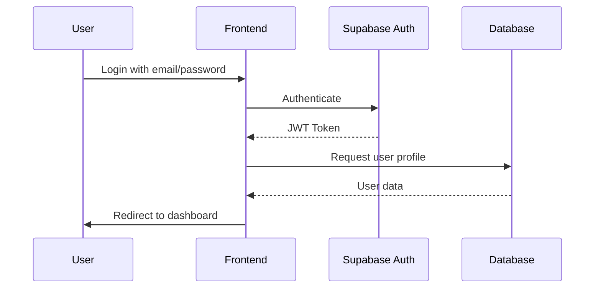
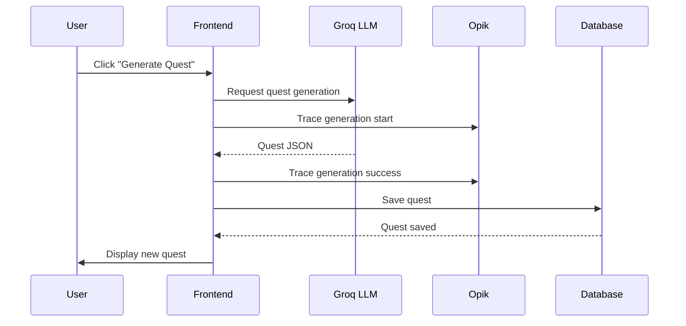
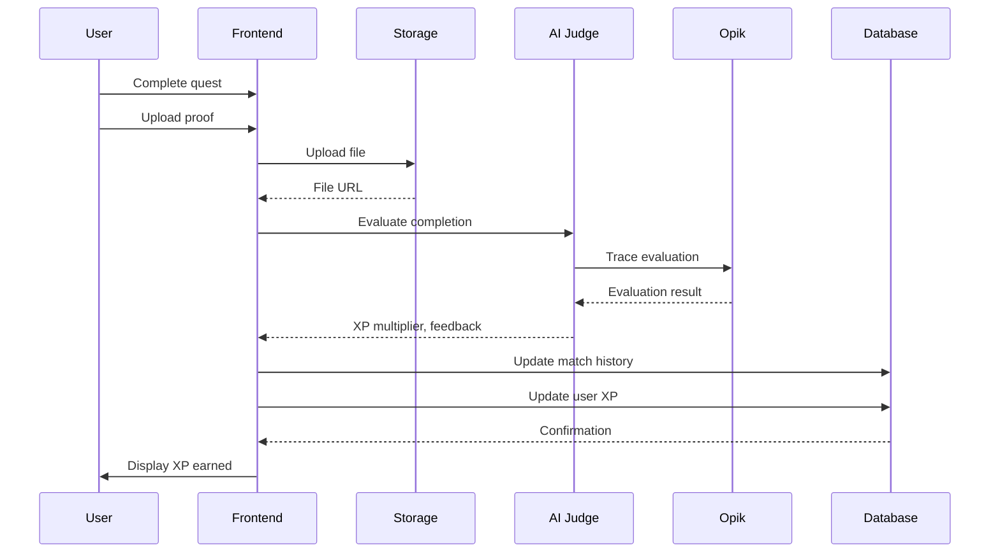

# System Architecture

High-level overview of ASCEND: FITNESS RPG's technical architecture.

## Architecture Diagram

```mermaid
graph TB
    subgraph "Frontend Layer"
        UI[React Components]
        State[React Context + Hooks]
        Router[Next.js App Router]
        Styles[Tailwind CSS]
        Anim[Framer Motion]
    end

    subgraph "Backend Layer"
        Auth[Supabase Auth]
        DB[(PostgreSQL Database]
        Storage[Supabase Storage]
        Edge[Supabase Edge Functions]
    end

    subgraph "AI Layer"
        QuestGen[Groq LLM - Quest Generation]
        Judge[Opik AI Judge]
        Tracing[Opik Observability]
    end

    subgraph "Client"
        Browser[Web Browser]
        Mobile[Mobile Devices]
    end

    Browser --> UI
    Mobile --> UI
    UI --> Router
    Router --> State
    Router --> Auth
    Router --> DB
    Router --> Edge
    Auth --> Edge
    Edge --> DB
    Storage --> DB
    State --> QuestGen
    Edge --> Judge
    Judge --> Tracing

    style UI fill:#00FFFF
    style DB fill:#3ECF8E
    style QuestGen fill:#FF0066
    style Judge fill:#00A67E
    style Tracing fill:#00D1B2
```

## Tech Stack

### Frontend

| Technology | Version | Purpose |
|-------------|----------|---------|
| Next.js | 14.0 | React framework with App Router |
| React | 18+ | UI library |
| TypeScript | 5.0+ | Type-safe JavaScript |
| Tailwind CSS | 3.4 | Utility-first styling |
| Framer Motion | 10+ | Animation library |
| Lucide React | Latest | Icon library |

### Backend

| Technology | Version | Purpose |
|-------------|----------|---------|
| Supabase | Latest | Backend-as-a-Service |
| PostgreSQL | 15 | Relational database |
| Supabase Auth | Latest | Authentication |
| Supabase Storage | Latest | File storage |
| Edge Functions | Latest | Serverless functions |

### AI Services

| Technology | Model | Purpose |
|-------------|--------|---------|
| Groq | Llama 3.3 70B | Quest generation |
| Opik | Comet Platform | AI monitoring & evaluation |

## Data Flow

### 1. User Authentication



### 2. Quest Generation



### 3. Quest Completion



## System Design Principles

### 1. Server-First Architecture

- **Server Components** for data fetching (improved performance)
- **Client Components** for interactivity
- **Edge Deployment** for global CDN access

**Benefits:**
- Faster initial page loads
- Better SEO
- Reduced client-side JavaScript

### 2. Type Safety

- **Strict TypeScript mode** enabled
- **Zero `any` types** policy
- **Comprehensive interfaces** for all data structures
- **Zod schemas** for runtime validation

**Benefits:**
- Catch errors at compile time
- Better IDE autocomplete
- Self-documenting code

### 3. Security by Design

- **Row-Level Security (RLS)** for data access control
- **Input validation** with Zod schemas
- **Proof upload verification** for anti-cheat
- **Rate limiting** on API endpoints

**Benefits:**
- Prevent data leaks
- Block malicious inputs
- Ensure fair gameplay

### 4. Performance First

- **Code splitting** for optimal bundle size
- **Image optimization** with Next.js Image
- **Database indexing** for fast queries
- **Edge caching** for static assets

**Benefits:**
- Fast page loads (< 2s)
- Smooth animations
- Low API latency (< 500ms)

## Scalability

### Current Capacity

| Metric | Capacity | Current Usage |
|--------|----------|---------------|
| Concurrent Users | 10,000 | < 100 (dev) |
| Quests/Day | 50,000 | N/A |
| Proof Uploads/Hour | 1,000 | N/A |
| Database Size | 1 TB | < 100 MB |

### Scaling Strategy

#### Database Scaling

- **Read Replicas**: Distribute read queries
- **Connection Pooling**: Efficient connection management
- **Partitioning**: Split large tables by date

#### Storage Scaling

- **CDN Distribution**: Serve files from edge locations
- **Image Compression**: Optimize proof uploads
- **Lazy Loading**: Load images on demand

#### AI Scaling

- **Rate Limiting**: Prevent API abuse
- **Prompt Caching**: Cache common prompts
- **Queue System**: Async quest generation

## Monitoring

### Opik Integration

All critical AI operations are traced:

| Operation | Traced | Metrics |
|------------|---------|----------|
| Quest Generation | ✅ | Response time, success rate |
| AI Judge Evaluation | ✅ | Evaluation time, score distribution |
| API Performance | ✅ | Response time, error rate |
| Error Tracking | ✅ | Error types, frequency |

### Performance Metrics

- **API Response Time**: P95 < 500ms
- **Quest Generation Success Rate**: > 98%
- **Judge Evaluation Accuracy**: > 90% user satisfaction
- **Page Load Time**: < 2s (P95)

## Deployment Architecture

### Frontend Deployment

```
┌─────────────────────────────────────┐
│         Vercel Edge Network        │
│  (Global CDN, Automatic Scaling)    │
└─────────────────────────────────────┘
                ↓
┌─────────────────────────────────────┐
│      Next.js App Router           │
│  (Server Components + Client)     │
└─────────────────────────────────────┘
```

### Backend Deployment

```
┌─────────────────────────────────────┐
│         Supabase Cloud          │
│  (Managed PostgreSQL + Auth)      │
└─────────────────────────────────────┘
                ↓
┌─────────────────────────────────────┐
│    Supabase Edge Functions       │
│  (Serverless, Auto-scaling)      │
└─────────────────────────────────────┘
```

### AI Services Deployment

```
┌─────────────────────────────────────┐
│         Groq API               │
│  (Llama 3.3 70B, Fast Inference) │
└─────────────────────────────────────┘

┌─────────────────────────────────────┐
│         Opik Platform           │
│  (Tracing, Monitoring, Analytics)   │
└─────────────────────────────────────┘
```

## Technology Justification

### Why Next.js 14?

- **App Router**: Better performance with React Server Components
- **TypeScript**: Built-in type safety
- **Image Optimization**: Automatic image optimization
- **SEO**: Server-side rendering for better SEO

### Why Supabase?

- **Open Source**: Full control over backend
- **PostgreSQL**: Powerful relational database
- **RLS**: Built-in security layer
- **Real-time**: Subscriptions for real-time features

### Why Groq?

- **Fast Inference**: Low latency for real-time generation
- **Cost Effective**: Competitive pricing
- **Open Source Models**: Llama 3.3 70B

### Why Opik?

- **Comprehensive**: Traces, metrics, error tracking
- **AI-Native**: Built for AI applications
- **Transparency**: User rights (know, control, access, delete)

## Next Steps

- [Frontend Architecture](./frontend-architecture.md)
- [Backend Architecture](./backend-architecture.md)
- [AI Integration](./ai-integration.md)

---

*Last Updated: February 5, 2026*
