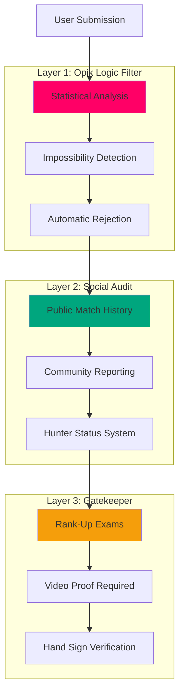

# Anti-Cheat System

> Three-layer defense system ensuring fair play and integrity

---

## Anti-Cheat Overview

ASCEND: FITNESS RPG implements a comprehensive **Three-Layer Anti-Cheat Defense** to maintain system integrity and fair competition.



---

## Layer 1: Opik Logic Filter

### Statistical Impossibility Detection

The first line of defense uses **statistical analysis** to detect physically impossible claims.

### Detection Rules

| Metric | Threshold | Action |
|--------|-----------|--------|
| Pushups in 1 minute | > 80 | Flag as suspicious |
| Miles in 1 minute | > 0.5 | Flag as suspicious |
| Workout duration (under) | < 5 min | Auto-reject |
| Workout duration (over) | > 180 min | Flag for review |
| XP per quest | > 4000 | Auto-reject |
| Jump in 1 minute | > 60 | Flag as suspicious |

### Implementation

```typescript
// lib/anti-cheat/logic-filter.ts
export interface QuestSubmission {
  questId: string;
  duration: number;
  exercises: ExerciseCompletion[];
  proofUrl: string;
  notes?: string;
}

export interface ExerciseCompletion {
  exerciseId: string;
  value: number; // reps, seconds, or distance
}

export interface FilterResult {
  passed: boolean;
  reason?: string;
  confidence: number; // 0-1
}

export async function checkImpossibility(
  submission: QuestSubmission,
  quest: Quest
): Promise<FilterResult> {
  const checks = [
    checkDuration(submission.duration, quest.duration_minutes),
    checkExerciseSpeed(submission.exercises),
    checkXPLimits(submission, quest),
    checkConsistency(submission, quest),
  ];

  const failedCheck = checks.find(check => !check.passed);

  if (failedCheck) {
    // Log to Opik
    await opik.trace('anti_cheat_flag', {
      user_id: submission.userId,
      quest_id: quest.id,
      reason: failedCheck.reason,
      confidence: failedCheck.confidence,
    });

    return failedCheck;
  }

  return { passed: true, confidence: 1.0 };
}

function checkDuration(
  actual: number,
  expected: number
): FilterResult {
  const ratio = actual / expected;

  // Too fast (cheating attempt)
  if (ratio < 0.4) {
    return {
      passed: false,
      reason: `Duration too short: ${actual}min vs expected ${expected}min`,
      confidence: 0.95,
    };
  }

  // Too long (extended breaks or fake)
  if (ratio > 3.0) {
    return {
      passed: false,
      reason: `Duration too long: ${actual}min vs expected ${expected}min`,
      confidence: 0.8,
    };
  }

  return { passed: true, confidence: 1.0 };
}

function checkExerciseSpeed(
  exercises: ExerciseCompletion[]
): FilterResult {
  for (const exercise of exercises) {
    // High-intensity exercises: more than 80 reps in 1 minute is suspicious
    if (exercise.value > 80 && exercise.type === 'reps') {
      return {
        passed: false,
        reason: `Impossible rep count: ${exercise.value} reps`,
        confidence: 0.9,
      };
    }

    // Running: more than 0.5 miles in 1 minute is impossible
    if (exercise.value > 0.5 && exercise.type === 'distance') {
      return {
        passed: false,
        reason: `Impossible distance: ${exercise.value} miles`,
        confidence: 0.95,
      };
    }
  }

  return { passed: true, confidence: 1.0 };
}

function checkXPLimits(
  submission: QuestSubmission,
  quest: Quest
): FilterResult {
  // Max XP per quest is 4000 (S-Rank quest)
  if (quest.xp_reward > 4000) {
    return {
      passed: false,
      reason: `XP exceeds limit: ${quest.xp_reward}`,
      confidence: 1.0,
    };
  }

  return { passed: true, confidence: 1.0 };
}

function checkConsistency(
  submission: QuestSubmission,
  quest: Quest
): FilterResult {
  // Check if completed exercises match quest exercises
  if (submission.exercises.length !== quest.exercises.length) {
    return {
      passed: false,
      reason: `Exercise count mismatch: ${submission.exercises.length} vs ${quest.exercises.length}`,
      confidence: 0.7,
    };
  }

  return { passed: true, confidence: 1.0 };
}
```

### Automatic Rejection

```typescript
export async function validateSubmission(
  submission: QuestSubmission
): Promise<{ valid: boolean; error?: string }> {
  const supabase = createClient();

  const { data: quest } = await supabase
    .from('quests')
    .select('*')
    .eq('id', submission.questId)
    .single();

  if (!quest) {
    return { valid: false, error: 'Quest not found' };
  }

  const result = await checkImpossibility(submission, quest);

  if (!result.passed) {
    // Flag user if confidence is high
    if (result.confidence > 0.85) {
      await flagUser(submission.userId, result.reason);
    }

    return {
      valid: false,
      error: `Submission rejected: ${result.reason}`,
    };
  }

  return { valid: true };
}

async function flagUser(
  userId: string,
  reason: string
): Promise<void> {
  const supabase = createClient();

  // Update hunter status to Flagged
  await supabase
    .from('profiles')
    .update({ hunter_status: 'Flagged' })
    .eq('id', userId);

  // Create system report
  await supabase
    .from('reports')
    .insert({
      reporter_id: 'system', // System-generated report
      reported_user_id: userId,
      reason: `Auto-flagged: ${reason}`,
      status: 'pending',
    });
}
```

---

## Layer 2: Social Audit

### Public Match History

All workout completions are **public by default**, creating social pressure and community oversight.

```typescript
// app/profile/[username]/page.tsx
export default async function PublicProfilePage({
  params,
}: {
  params: { username: string };
}) {
  const supabase = createClient();

  // Fetch public profile data
  const { data: profile } = await supabase
    .from('profiles')
    .select('*')
    .eq('username', params.username)
    .single();

  // Fetch public match history
  const { data: matchHistory } = await supabase
    .from('match_history')
    .select(`
      *,
      quest:quests!inner(
        title,
        difficulty,
        xp_reward
      )
    `)
    .eq('user_id', profile.id)
    .order('completed_at', { ascending: false })
    .limit(50);

  return (
    <div className="profile-page">
      <UserProfile profile={profile} />
      <MatchHistory history={matchHistory} />
      <ReportButton userId={profile.id} />
    </div>
  );
}
```

### Community Reporting System

Users can report suspicious activity to the moderation team.

```typescript
'use server';

import { createClient } from '@/lib/supabase/server';

export async function reportUserAction(formData: FormData) {
  const supabase = createClient();
  const { data: { user } } = await supabase.auth.getUser();

  if (!user) {
    return { error: 'Unauthorized' };
  }

  const reportedUserId = formData.get('reportedUserId') as string;
  const reason = formData.get('reason') as string;

  // Create report
  const { error } = await supabase
    .from('reports')
    .insert({
      reporter_id: user.id,
      reported_user_id: reportedUserId,
      reason: reason,
      status: 'pending',
    });

  if (error) {
    return { error: 'Failed to submit report' };
  }

  // Auto-flag if multiple reports
  const { data: reportCount } = await supabase
    .from('reports')
    .select('id', { count: 'exact' })
    .eq('reported_user_id', reportedUserId)
    .eq('status', 'pending');

  if (reportCount && reportCount.length >= 5) {
    await supabase
      .from('profiles')
      .update({ hunter_status: 'Flagged' })
      .eq('id', reportedUserId);
  }

  return { success: true };
}
```

### Hunter Status System

Users have a visible **Hunter Status** badge that affects their XP and leaderboard eligibility.

| Status | Badge | XP Modifier | Leaderboard | Requirements |
|--------|-------|-------------|-------------|--------------|
| **Normal** | Gray | 1.0x | ✅ | Default |
| **Verified** | Cyan ✓ | 1.1x | ✅ | Completed 50+ quests with good ratings |
| **Flagged** | Yellow ⚠️ | 0.8x | ⚠️ Warning | Multiple reports or suspicious activity |
| **Corrupted** | Red ☠️ | 0.0x | ❌ Banned | Verified cheating behavior |

```typescript
export interface HunterStatus {
  status: 'Normal' | 'Verified' | 'Flagged' | 'Corrupted';
  xpMultiplier: number;
  leaderboardEligible: boolean;
}

export function getHunterStatusBadge(status: string) {
  const badges: Record<string, { color: string; icon: string }> = {
    'Normal': { color: 'text-gray-400', icon: '●' },
    'Verified': { color: 'text-cyan-400', icon: '✓' },
    'Flagged': { color: 'text-yellow-400', icon: '⚠️' },
    'Corrupted': { color: 'text-red-500', icon: '☠️' },
  };

  return badges[status] || badges['Normal'];
}

export function getXPMultiplier(status: string): number {
  const multipliers: Record<string, number> = {
    'Normal': 1.0,
    'Verified': 1.1,
    'Flagged': 0.8,
    'Corrupted': 0.0,
  };

  return multipliers[status] || 1.0;
}
```

---

## Layer 3: Gatekeeper

### Rank-Up Exam Requirements

Users must pass **rank-up exams** to progress to higher hunter ranks.

```typescript
export interface RankUpExam {
  id: string;
  user_id: string;
  target_rank: 'D' | 'C' | 'B' | 'A' | 'S';
  proof_url: string;
  hand_sign_video?: string;
  status: 'pending' | 'submitted' | 'under_review' | 'approved' | 'rejected';
}

export async function requestRankUpExam(
  userId: string,
  targetRank: string
): Promise<{ success: boolean; error?: string }> {
  const supabase = createClient();

  // Check user's current rank
  const { data: profile } = await supabase
    .from('profiles')
    .select('rank_tier, level, xp')
    .eq('id', userId)
    .single();

  if (!profile) {
    return { error: 'Profile not found' };
  }

  // Check if user meets level requirement
  const rankRequirements: Record<string, number> = {
    'D': 2,
    'C': 5,
    'B': 10,
    'A': 20,
    'S': 50,
  };

  if (profile.level < rankRequirements[targetRank]) {
    return {
      error: `Insufficient level for ${targetRank}-Rank`,
    };
  }

  // Create exam request
  const { error } = await supabase
    .from('rank_up_exams')
    .insert({
      user_id: userId,
      target_rank: targetRank,
      proof_url: '', // To be uploaded
      status: 'pending',
    });

  if (error) {
    return { error: 'Failed to create exam request' };
  }

  return { success: true };
}
```

### Video Proof Verification

Users must submit **video proof** for rank-up exams, including a unique hand sign to prove freshness.

```typescript
'use server';

import { createClient } from '@/lib/supabase/server';
import { uploadProof } from '@/lib/supabase/storage';

export async function submitRankUpExamProof(formData: FormData) {
  const supabase = createClient();
  const { data: { user } } = await supabase.auth.getUser();

  if (!user) {
    return { error: 'Unauthorized' };
  }

  const examId = formData.get('examId') as string;
  const proofVideo = formData.get('proofVideo') as File;
  const handSignVideo = formData.get('handSignVideo') as File;

  // Upload proof videos
  const proofUrl = await uploadProof(user.id, examId, proofVideo);
  const handSignUrl = await uploadProof(user.id, examId, handSignVideo);

  // Update exam with proof URLs
  const { error } = await supabase
    .from('rank_up_exams')
    .update({
      proof_url: proofUrl,
      hand_sign_video: handSignUrl,
      status: 'under_review',
    })
    .eq('id', examId);

  if (error) {
    return { error: 'Failed to submit proof' };
  }

  return { success: true };
}
```

### Admin Review

Admins review rank-up exam submissions and approve or reject based on proof quality.

```typescript
'use server';

import { createClient } from '@/lib/supabase/server';

export async function reviewRankUpExam(
  examId: string,
  approved: boolean,
  adminNotes?: string
): Promise<{ success: boolean; error?: string }> {
  const supabase = createClient();
  const { data: { user } } = await supabase.auth.getUser();

  if (!user) {
    return { error: 'Unauthorized' };
  }

  // Verify user is admin
  const { data: profile } = await supabase
    .from('profiles')
    .select('role')
    .eq('id', user.id)
    .single();

  if (profile?.role !== 'admin') {
    return { error: 'Forbidden: Admin access required' };
  }

  // Fetch exam details
  const { data: exam } = await supabase
    .from('rank_up_exams')
    .select('*')
    .eq('id', examId)
    .single();

  if (!exam) {
    return { error: 'Exam not found' };
  }

  if (approved) {
    // Update exam status
    await supabase
      .from('rank_up_exams')
      .update({
        status: 'approved',
        admin_notes: adminNotes,
        reviewed_at: new Date().toISOString(),
      })
      .eq('id', examId);

    // Update user rank
    await supabase
      .from('profiles')
      .update({
        rank_tier: exam.target_rank,
        hunter_status: 'Verified',
      })
      .eq('id', exam.user_id);
  } else {
    // Reject exam
    await supabase
      .from('rank_up_exams')
      .update({
        status: 'rejected',
        admin_notes: adminNotes,
        reviewed_at: new Date().toISOString(),
      })
      .eq('id', examId);

    // Flag user if suspicious
    if (adminNotes?.toLowerCase().includes('suspicious')) {
      await supabase
        .from('profiles')
        .update({ hunter_status: 'Flagged' })
        .eq('id', exam.user_id);
    }
  }

  return { success: true };
}
```

---

## Database Triggers

### XP Update Validation

```sql
CREATE OR REPLACE FUNCTION check_xp_update()
RETURNS TRIGGER AS $$
BEGIN
  -- Prevent impossible XP jumps (max 4000 per quest)
  IF NEW.xp - OLD.xp > 4000 THEN
    RAISE EXCEPTION 'Invalid XP increase: % to %', OLD.xp, NEW.xp
    USING ERRCODE = '23505';
  END IF;
  
  -- Prevent negative XP
  IF NEW.xp < 0 THEN
    RAISE EXCEPTION 'XP cannot be negative'
    USING ERRCODE = '23514';
  END IF;
  
  RETURN NEW;
END;
$$ LANGUAGE plpgsql;

CREATE TRIGGER enforce_xp_limits
BEFORE UPDATE OF xp ON profiles
FOR EACH ROW EXECUTE FUNCTION check_xp_update();
```

### Auto-Flag on Reports

```sql
CREATE OR REPLACE FUNCTION auto_flag_on_reports()
RETURNS TRIGGER AS $$
DECLARE
  report_count INT;
BEGIN
  -- Count pending reports against this user
  SELECT COUNT(*) INTO report_count
  FROM reports
  WHERE reported_user_id = NEW.reported_user_id
    AND status = 'pending';
  
  -- Auto-flag if 5+ pending reports
  IF report_count >= 5 THEN
    UPDATE profiles
    SET hunter_status = 'Flagged'
    WHERE id = NEW.reported_user_id;
  END IF;
  
  RETURN NEW;
END;
$$ LANGUAGE plpgsql;

CREATE TRIGGER check_report_threshold
AFTER INSERT ON reports
FOR EACH ROW EXECUTE FUNCTION auto_flag_on_reports();
```

### Auto-Verify on Proof

```sql
CREATE OR REPLACE FUNCTION auto_verify_on_proof()
RETURNS TRIGGER AS $$
DECLARE
  quest_count INT;
BEGIN
  -- Count quests completed with proof
  SELECT COUNT(*) INTO quest_count
  FROM match_history
  WHERE user_id = NEW.user_id
    AND proof_url IS NOT NULL
    AND judge_overall_score >= 0.8;
  
  -- Auto-verify if 50+ high-quality completions
  IF quest_count >= 50 THEN
    UPDATE profiles
    SET hunter_status = 'Verified'
    WHERE id = NEW.user_id;
  END IF;
  
  RETURN NEW;
END;
$$ LANGUAGE plpgsql;

CREATE TRIGGER check_verification_threshold
AFTER INSERT ON match_history
FOR EACH ROW EXECUTE FUNCTION auto_verify_on_proof();
```

---

## Prevention Summary

| Prevention | Method | Effective Against |
|------------|--------|-------------------|
| **Opik Logic Filter** | Statistical analysis | Speed hacking, impossible claims |
| **Public Match History** | Social pressure | General dishonesty |
| **Community Reports** | User moderation | Suspicious behavior |
| **Hunter Status** | Status-based penalties | Repeat offenders |
| **Rank-Up Exams** | Video proof | Rank manipulation |
| **Hand Signs** | Freshness verification | Using old footage |
| **Database Triggers** | Server-side validation | Direct database manipulation |

---

*Last Updated: February 5, 2026*
