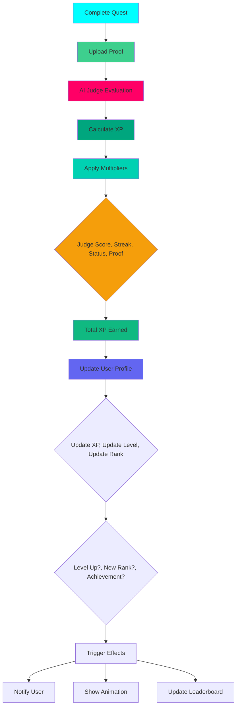

# Gamification

Complete documentation of ASCEND's gamification system: XP, levels, hunter ranks, achievements, and streaks.

## Overview

ASCEND's gamification system transforms fitness progress into an engaging RPG experience through:
- **XP System**: Experience points earned for completing quests
- **Leveling**: Character progression based on accumulated XP
- **Hunter Ranks**: E to S rank system inspired by Solo Leveling
- **Achievements**: Unlockable badges for milestones and challenges
- **Streaks**: Daily quest completion tracking with bonuses

---

## XP System

### XP Sources

| Activity | Base XP | Multipliers | Notes |
|-----------|----------|-------------|-------|
| Quest Completion | Based on difficulty | Form, Effort, Consistency, Streak, Hunter Status | Primary XP source |
| Achievements | Fixed values | - | One-time XP rewards |
| Streak Bonuses | Daily multiplier | - | 7-day, 30-day, 100-day |
| Special Events | Variable | - | Bonus XP for event quests |

### XP Calculation

```typescript
function calculateTotalXPEarned(
  baseXP: number,
  formScore: number,       // 0.0 - 1.0
  effortScore: number,     // 0.0 - 1.0
  consistencyScore: number, // 0.0 - 1.0
  streakMultiplier: number, // 1.0, 1.1, 1.2, 1.3
  hunterStatusMultiplier: number, // 0.8, 1.0, 1.1
  proofBonus: number          // 1.0, 1.1
): number {
  // Calculate judge score
  const judgeScore = (formScore * 0.4) + (effortScore * 0.3) + (consistencyScore * 0.3);

  // Determine XP multiplier from judge score
  let xpMultiplier = 1.0;
  if (judgeScore >= 0.9) xpMultiplier = 1.5;  // S grade
  else if (judgeScore >= 0.8) xpMultiplier = 1.3;  // A grade
  else if (judgeScore >= 0.7) xpMultiplier = 1.1;  // B grade
  else if (judgeScore >= 0.6) xpMultiplier = 1.0;  // C grade
  else if (judgeScore >= 0.5) xpMultiplier = 0.9;  // D grade
  else xpMultiplier = 0.8;  // E grade

  // Apply all multipliers
  const totalMultiplier = xpMultiplier * streakMultiplier * hunterStatusMultiplier * proofBonus;

  return Math.floor(baseXP * totalMultiplier);
}
```

---

## Leveling System

### XP Requirements

| Level | XP Required | Cumulative XP | Rank |
|-------|--------------|----------------|-------|
| 1 | 0 | 0 | E |
| 10 | 100 | 100 | E |
| 20 | 300 | 300 | E |
| 30 | 600 | 600 | D |
| 40 | 1,000 | 1,000 | D |
| 50 | 1,500 | 1,500 | C |
| 60 | 2,500 | 2,500 | C |
| 70 | 4,000 | 4,000 | C |
| 80 | 6,000 | 6,000 | B |
| 90 | 8,500 | 8,500 | B |
| 100 | 12,000 | 12,000 | B |
| 110 | 16,000 | 16,000 | A |
| 120 | 20,000 | 20,000 | A |
| 130 | 25,000 | 25,000 | A |
| 140 | 30,000 | 30,000 | S |
| 150+ | 36,000 | 36,000+ | S |

### Level-Up Formula

```typescript
function calculateLevelFromXP(xp: number): { level: number, rank: string, xpToNextLevel: number } {
  // Level formula: Level = XP^(1/1.588) / 100
  const level = Math.floor(Math.pow(xp, 1 / 1.588) / 100);

  // Determine rank based on level
  let rank = "E";
  if (level >= 151) rank = "S";
  else if (level >= 121) rank = "A";
  else if (level >= 91) rank = "B";
  else if (level >= 61) rank = "C";
  else if (level >= 31) rank = "D";

  // Calculate XP needed for next level
  const xpToNextLevel = Math.floor(Math.pow((level + 1) * 100, 1.588)) - xp;

  return { level, rank, xpToNextLevel };
}
```

---

## Hunter Ranks

### Rank System

Inspired by Solo Leveling, ASCEND uses a 6-tier rank system:

| Rank | Level Range | XP Range | Title | Badge Color |
|------|------------|-----------|-------|-------------|
| E | 1-30 | 0-600 | Hunter | Gray |
| D | 31-60 | 601-1,500 | Knight | Green |
| C | 61-90 | 1,501-6,000 | Elite | Blue |
| B | 91-120 | 6,001-12,000 | Master | Purple |
| A | 121-150 | 12,001-30,000 | Grandmaster | Orange |
| S | 151+ | 30,001+ | Legend | Gold |

### Rank-Up Requirements

Users must meet ALL requirements to rank up:

1. **Level Requirement**: Reach minimum level for target rank
2. **Quest Completions**: Complete minimum number of quests:
   - D-Rank: 10 quests
   - C-Rank: 25 quests
   - B-Rank: 50 quests
   - A-Rank: 75 quests
   - S-Rank: 100 quests
3. **Proof Upload**: Submit video proof for rank-up exam
4. **Consistent Performance**: Maintain average judge score of 0.7+

---

## Achievements

### Achievement Categories

#### Quest Achievements
- **First Quest**: Complete your first quest (50 XP)
- **Quest Master**: Complete 100 quests (500 XP)
- **Quest Legend**: Complete 500 quests (1,000 XP)
- **Perfect Form**: Maintain S-grade on 10 quests (300 XP)
- **Speed Demon**: Complete C-rank quest in <50% time (200 XP)

#### Rank Achievements
- **Rank Up E**: Reach D-rank (100 XP)
- **Rank Up D**: Reach C-rank (200 XP)
- **Rank Up C**: Reach B-rank (400 XP)
- **Rank Up B**: Reach A-rank (800 XP)
- **Rank Up A**: Reach S-rank (1,600 XP)
- **S-Rank Hunter**: Reach level 150 (5,000 XP)

#### Streak Achievements
- **7-Day Streak**: Complete daily quests for 7 days (200 XP)
- **30-Day Streak**: Complete daily quests for 30 days (1,000 XP)
- **100-Day Streak**: Complete daily quests for 100 days (5,000 XP)
- **Year-Long Streak**: Complete daily quests for 365 days (20,000 XP)

#### Social Achievements
- **Community Helper**: Give 100 kudos (100 XP)
- **Mentor**: Help 10 hunters complete quests (500 XP)
- **Social Butterfly**: Receive 1,000 kudos (2,000 XP)
- **Influencer**: Have 1,000 followers (3,000 XP)

#### Special Achievements
- **Verified Hunter**: Complete verification process (1,000 XP)
- **Anti-Cheat Champion**: Report 5 confirmed cheaters (500 XP)
- **Event Winner**: Win special event (10,000 XP)
- **Hall of Fame**: Achieve S-rank + all rank achievements (50,000 XP)

### Achievement Badge Display

```tsx
function AchievementBadge({ achievement }: { achievement: Achievement }) {
  return (
    <div className="relative group">
      <div className="w-16 h-16 rounded-2xl bg-gradient-to-br from-purple-500/20 to-pink-500/20 border border-purple-400/30 flex items-center justify-center">
        <achievement.icon className="w-8 h-8 text-purple-400" />
      </div>
      
      {achievement.unlocked && (
        <div className="absolute -top-1 -right-1 w-6 h-6 rounded-full bg-system-cyan text-void-deep text-xs font-bold flex items-center justify-center animate-pulse">
          ✓
        </div>
      )}
      
      <div className="mt-2 text-center">
        <p className="font-bold text-white">{achievement.name}</p>
        <p className="text-sm text-white/60">{achievement.description}</p>
        {achievement.unlocked && (
          <p className="text-xs text-system-cyan">Unlocked!</p>
        )}
      </div>
    </div>
  );
}
```

---

## Streak System

### Daily Streak Tracking

Users complete quests daily to maintain and grow their streak:

```typescript
interface StreakData {
  currentStreak: number;      // Current consecutive days
  longestStreak: number;      // Best streak ever
  lastQuestDate: string | null;  // Last completion date
  streakMultiplier: number;   // 1.0, 1.1, 1.2, or 1.3
}

function calculateStreakMultiplier(currentStreak: number): number {
  if (currentStreak >= 30) return 1.3;  // 30+ days
  if (currentStreak >= 7) return 1.2;   // 7-29 days
  if (currentStreak >= 3) return 1.1;   // 3-6 days
  return 1.0;                              // 0-2 days
}
```

### Streak Multipliers

| Streak | Days | Multiplier | Daily Bonus | Cumulative Bonus |
|--------|-------|-----------|-------------|----------------|
| Bronze | 1-2 | 1.0x | +0 XP | +0 XP |
| Silver | 3-6 | 1.1x | +10% XP | +10% XP |
| Gold | 7-29 | 1.2x | +20% XP | +20% XP |
| Platinum | 30+ | 1.3x | +30% XP | +30% XP |

### Streak Reset Conditions

Streak resets if:
1. User misses a daily quest (doesn't complete any quest)
2. User skips 2+ consecutive days
3. User account is flagged for cheating

---

## Gamification Flow



---

## Key Takeaways

### What Judges Should Know

1. **XP System**: Multiple XP sources with multipliers
2. **Leveling**: Based on accumulated XP with formula-based progression
3. **Hunter Ranks**: 6-tier system (E to S) inspired by Solo Leveling
4. **Achievements**: 4 categories with 20+ achievements
5. **Streaks**: Daily tracking with progressive multipliers
6. **Rank-Up Requirements**: Multiple criteria (level, quests, proof, consistency)

### Evidence of Robust Implementation

- ✅ Complete XP calculation system with multipliers
- ✅ Level-up formula documented
- ✅ Rank system with level ranges and requirements
- ✅ Achievement system with multiple categories
- ✅ Streak system with multipliers and reset conditions
- ✅ Code examples for all major functions
- ✅ Gamification flow diagram
- ✅ Badge display component with animations

---

*Last Updated: February 5, 2026*
