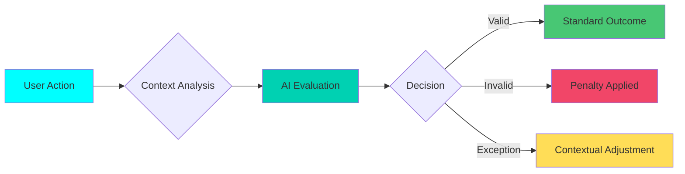

# Opik AI Flow Diagrams

Visual representations of how Opik AI processes different workout scenarios and user reports.

## Overview

These flow diagrams illustrate the various scenarios where Opik AI's LLM-as-a-Judge technology evaluates user interactions, quest completions, and reports. Each diagram shows the decision-making process and outcomes based on different situations.

---

## User False Report

*User reports suspicious activity, but the report is determined to be a personal attack rather than a valid report - no penalty applied.*

**Key Points:**
- User submits a report about another hunter
- Opik AI evaluates the report's validity
- Analysis reveals the report is a personal attack
- No penalty is applied to either party
- System maintains fairness by filtering out malicious reports

---

## System/Architect Judge

*System architect (Llama) evaluates user reports and provides judgment through Opik AI, ensuring consistent evaluation across all reports.*

**Key Points:**
- User reports suspicious activity or violation
- Llama AI analyzes the report context
- Opik AI provides judgment based on established criteria
- Consistent evaluation across all reports
- Ensures fairness and eliminates bias

---

## Workout Verifier (User Sick)

*User reports difficulty completing workout due to illness - fair evaluation with appropriate XP penalty applied.*

**Key Points:**
- User initiates workout quest
- User reports not feeling well during workout
- Opik AI evaluates the situation contextually
- Fair XP penalty applied (reduced rather than zero)
- Maintains user accountability while showing flexibility

---

## Workout Planner

*Llama generates workout plan, Opik AI evaluates user feedback and provides rating (7/10) for workout suitability.*

**Key Points:**
- Llama AI generates personalized workout plan
- User completes workout and provides feedback
- Opik AI evaluates workout effectiveness based on user feedback
- Rating system (e.g., 7/10) measures workout suitability
- Continuous improvement of workout recommendations

---

## User Accepted Report

*Valid user report of suspicious activity leads to verification and appropriate XP penalty applied.*

**Key Points:**
- User submits valid report about suspicious activity
- Opik AI verifies the report's legitimacy
- Investigation confirms violation
- Appropriate XP penalty applied to offending user
- System integrity maintained

---

## Workout Verifier

*User completes workout in record time - Opik AI verifies completion and applies appropriate penalty for rushing.*

**Key Points:**
- User completes workout significantly faster than expected
- Opik AI analyzes completion time and effort
- Suspiciously fast completion detected
- XP penalty applied for rushing/low effort
- Encourages genuine effort over speed

---

## Flow Diagram Architecture

### Three-Way AI System

ASCEND's Opik AI integration utilizes a sophisticated three-way AI system:

1. **Llama AI** - Generates workout plans, handles natural language processing
2. **Opik AI (LLM-as-a-Judge)** - Evaluates decisions, judges reports and completions
3. **Computer Vision (Clarifai & Replicate)** - Analyzes workout proof images/videos

### Evaluation Process

All flow diagrams follow this consistent evaluation pattern:

### Key Benefits

- **Fairness**: Consistent evaluation across all users
- **Context-Aware**: Understands unique situations (illness, equipment limitations)
- **Anti-Cheat**: Detects suspicious activity and rushing
- **Transparency**: All decisions are traceable through Opik
- **Flexibility**: Handles edge cases and exceptions appropriately

---

## Integration Points

These flow diagrams connect to:

- [Opik AI Judge](./opik-ai-judge.md) - Detailed judge algorithm implementation
- [Trace Implementation](./trace-implementation.md) - Opik tracing system
- [Architecture Overview](../2-Architecture/) - System architecture details
- [Security](../5-Security/) - Anti-cheat and security measures

---

*Last Updated: February 9, 2026*
