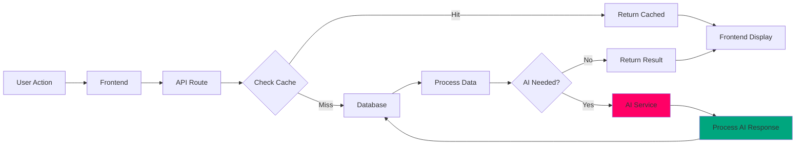
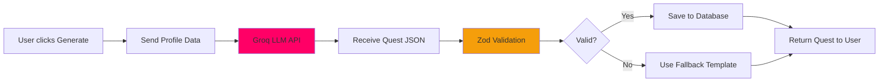

# Data Flow

How data moves through the ASCEND system.

## Data Flow Diagram

## Key Data Flows

### 1. Quest Generation

### 2. Quest Completion & Evaluation

```mermaid
graph LR
    A[User Uploads Proof] --> B[API Receives]
    B --> C[Store Proof]
    C --> D[Send to OPIK AI]
    D --> E[OPIK AI Analyzes]
    E --> F[Return Scores]
    F --> G[Calculate XP]
    G --> H[Update User Stats]
    H --> I[Update Leaderboard]
    I --> J[Return Results]

    style D fill:#00a67e
    style G fill:#f59e0b
```

### 3. Leaderboard Update

## Database Schema

### Users Table

| Field | Type | Description |
| ----- | ---- | ----------- |
| id | UUID | Primary key |
| email | string | User email |
| xp | integer | Total XP |
| level | integer | Current level |
| rank | enum | E/D/C/B/A/S |
| class | enum | Tank/Striker/Assassin |

### Quests Table

| Field | Type | Description |
| ----- | ---- | ----------- |
| id | UUID | Primary key |
| user_id | UUID | Foreign key to users |
| rank | enum | Quest rank |
| xp | integer | Base XP |
| completed_at | timestamp | Completion time |
| evaluation | jsonb | OPIK AI results |

### Evaluations Table

| Field | Type | Description |
| ----- | ---- | ----------- |
| id | UUID | Primary key |
| quest_id | UUID | Foreign key to quests |
| form_score | float | Form quality (0-1) |
| effort_score | float | Effort level (0-1) |
| consistency_score | float | Consistency (0-1) |
| overall_score | float | Overall (0-1) |
| grade | enum | S/A/B/C/D/E |
| multiplier | float | XP multiplier |

## Caching Strategy

| Data | Cache Duration | Reason |
| ---- | ------------- | ------ |
| Leaderboard | 5 minutes | High frequency updates |
| User profile | 1 hour | Low frequency changes |
| Quest templates | Permanent | Rare changes |
| AI responses | 24 hours | Reusable patterns |

[Back to System Overview →](./system-overview.md)

---

*Last Updated: February 11, 2026*
