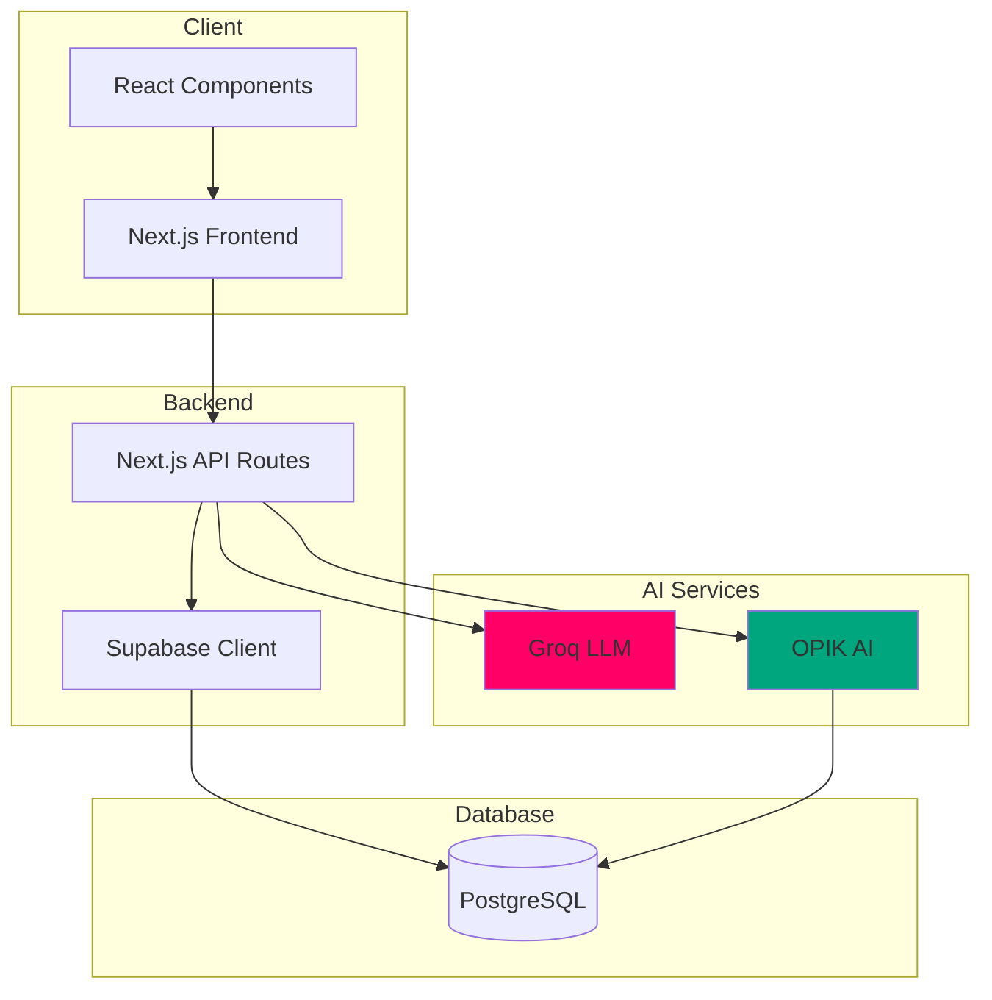

# System Overview

<figure><figcaption>
ASCEND system architecture overview
</figcaption></figure>

ASCEND is a full-stack fitness RPG built with modern web technologies and AI integration.

## Architecture Diagram

## System Components

| Component | Technology | Purpose |
| --------- | ---------- | ------- |
| **Frontend** | Next.js 14, React 18 | User interface |
| **Backend** | Next.js API Routes | Server-side logic |
| **Database** | PostgreSQL (Supabase) | Data persistence |
| **Auth** | Supabase Auth | User authentication |
| **AI Generation** | Groq LLM | Quest creation |
| **AI Evaluation** | OPIK AI | Quest scoring |

## Data Flow

1. **User requests quest** → Frontend → API → Groq LLM → Quest generated
2. **User completes quest** → Frontend → API → Database
3. **User uploads proof** → Frontend → API → OPIK AI → Evaluation
4. **XP awarded** → OPIK AI → Database → Leaderboard updated
5. **User views stats** → Frontend → API → Database → Response

## Deployment

| Service | Platform |
| ------- | -------- |
| Frontend | Vercel |
| Database | Supabase |
| AI Services | Groq API, OPIK AI API |

## Security

| Aspect | Implementation |
| ------- | -------------- |
| Authentication | Supabase Auth with JWT |
| Data encryption | TLS in transit, encryption at rest |
| API security | Rate limiting, API keys |
| User data | Private by default |

[Learn about Tech Stack →](./tech-stack.md)

---

*Last Updated: February 11, 2026*
