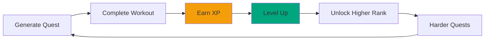

# Gamification

How ASCEND uses RPG mechanics to make fitness engaging.

## Game Loop

## Hunter Ranks

| Rank | Level Range | Title | XP Required |
| ---- | ----------- | ----- | ----------- |
| E | 1-10 | Novice | 0-1,000 |
| D | 11-20 | Apprentice | 1,001-2,500 |
| C | 21-30 | Adept | 2,501-5,000 |
| B | 31-50 | Expert | 5,001-12,000 |
| A | 51-70 | Master | 12,001-25,000 |
| S | 71-100 | Legend | 25,001+ |

## Hunter Classes

| Class | Style | Best For |
| ----- | ----- | -------- |
| **Tank** | Strength | Building muscle |
| **Striker** | Speed | Explosive power |
| **Assassin** | Agility | Endurance & HIIT |

## Achievements

| Achievement | Requirement | Reward |
| ----------- | ------------ | ------ |
| First Quest | Complete first quest | +100 XP |
| Streak 7 | 7 days in a row | +5% XP bonus |
| C-Rank | Reach C rank | Unlock badge |
| B-Rank | Reach B rank | Unlock badge |
| A-Rank | Reach A rank | Unlock badge |
| S-Rank | Reach S rank | Legend badge |

## Daily Bonuses

| Bonus | Condition | Reward |
| ----- | --------- | ------ |
| Login | Daily login | 50 XP |
| Streak | Consecutive days | +5% per day |
| First Quest | First quest of day | +10% XP |

## Leaderboards

| Type | Description |
| ---- | ----------- |
| **Global** | All users ranked by XP |
| **Rank-Specific** | Users within same rank |
| **Class-Specific** | Users within same class |

## Progress Visualization

| Element | Shows |
| ------- | ----- |
| XP Bar | Progress to next level |
| Rank Badge | Current hunter rank |
| Class Icon | Chosen class |
| Level | Current level number |
| Total XP | Lifetime XP earned |

[Learn about Anti-Cheat →](./anti-cheat.md)

---

*Last Updated: February 11, 2026*
