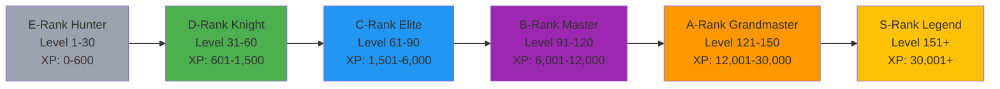

# Understanding the Hunter Ranking System

Complete guide to ASCEND's 6-tier ranking system inspired by Solo Leveling.

## Overview

ASCEND uses a hunter ranking system with 6 tiers from E (lowest) to S (highest). Your rank is determined by your level, which is calculated from accumulated XP.

---

## Rank Tiers

### The 6 Ranks

| Rank | Level Range | Total XP Required | Title | Badge Color | Description |
|------|-------------|---------------------|-------|-------------|-------------|
| **E** | 1-30 | 0-600 | Hunter | Gray | Beginner hunters, just starting their journey |
| **D** | 31-60 | 601-1,500 | Knight | Green | Experienced hunters, completed many quests |
| **C** | 61-90 | 1,501-6,000 | Elite | Blue | Skilled hunters, showing consistent progress |
| **B** | 91-120 | 6,001-12,000 | Master | Purple | Advanced hunters, pushing their limits |
| **A** | 121-150 | 12,001-30,000 | Grandmaster | Orange | Expert hunters, nearing the top |
| **S** | 151+ | 30,001+ | Legend | Gold | Elite hunters, the best of the best |

### Rank Progression Visual



---

## Level System

### XP to Level Formula

Your level is calculated from your total XP using the formula:

```
Level = ⌊ XP^(1/1.588) / 100 ⌋
```

This means:
- Each level requires more XP than the previous one
- XP needed grows exponentially
- First few levels are easy to achieve
- Later levels require significantly more XP

### Level Breakdown

| Level | XP Required | Cumulative XP | Rank |
|-------|-------------|---------------|-------|
| 1 | 0 | 0 | E |
| 10 | 100 | 100 | E |
| 20 | 398 | 398 | E |
| 30 | 600 | 600 | E |
| 31 | 608 | 608 | D |
| 40 | 1,265 | 1,265 | D |
| 50 | 2,000 | 2,000 | D |
| 60 | 3,000 | 3,000 | D |
| 61 | 3,158 | 3,158 | C |
| 70 | 3,658 | 3,658 | C |
| 80 | 4,367 | 4,367 | C |
| 90 | 6,000 | 6,000 | C |
| 91 | 6,292 | 6,292 | B |
| 100 | 8,000 | 8,000 | B |
| 110 | 9,929 | 9,929 | B |
| 120 | 12,000 | 12,000 | B |
| 121 | 14,464 | 14,464 | A |
| 130 | 16,241 | 16,241 | A |
| 140 | 18,099 | 18,099 | G |
| 150 | 20,000 | 20,000 | A |
| 151 | 21,253 | 21,253 | S |

---

## Quest Difficulty by Rank

Quests scale in difficulty based on your current rank:

### E-Rank (Level 1-30)
- **Quests**: Beginner bodyweight exercises
- **XP Range**: 50-100 XP per quest
- **Duration**: 20-30 minutes
- **Example**: Foundation Push-up Protocol (50 XP)

### D-Rank (Level 31-60)
- **Quests**: Basic equipment workouts
- **XP Range**: 150-300 XP per quest
- **Duration**: 30-45 minutes
- **Example**: Dumbbell Strength Foundation (200 XP)

### C-Rank (Level 61-90)
- **Quests**: Intermediate exercises
- **XP Range**: 500-800 XP per quest
- **Duration**: 45-60 minutes
- **Example**: Compound Movement Training (600 XP)

### B-Rank (Level 91-120)
- **Quests**: Advanced multi-exercise workouts
- **XP Range**: 800-1,500 XP per quest
- **Duration**: 60-90 minutes
- **Example**: High-Intensity Interval Training (1,000 XP)

### A-Rank (Level 121-150)
- **Quests**: Complex elite workouts
- **XP Range**: 1,500-2,500 XP per quest
- **Duration**: 90-120 minutes
- **Example**: Elite Performance Protocol (2,000 XP)

### S-Rank (Level 151+)
- **Quests**: Master-level challenges
- **XP Range**: 2,500-4,000 XP per quest
- **Duration**: 120-180 minutes
- **Example**: Legend's Ultimate Challenge (3,500 XP)

---

## Hunter Status System

ASCEND uses a Hunter Status system to indicate verified users:

### Status Levels

| Status | Badge | XP Modifier | Leaderboard | Description |
|---------|-------|-------------|-------------|-------------|
| **Normal** | Gray | 1.0x | ✅ Shown | Default status for new users |
| **Verified** | Cyan ✓ | 1.1x | ✅ Shown | Completed verification process |
| **Flagged** | Yellow ⚠️ | 0.8x | ⚠️ Warning | Suspicious activity detected |
| **Corrupted** | Red ❌ | 0.0x | ❌ Hidden | Confirmed cheater, banned |

### Status Effects

**Normal (Gray Badge)**
- Full XP multiplier (1.0x)
- Visible on all leaderboards

**Verified (Cyan Badge)**
- 10% bonus XP (1.1x multiplier)
- "Verified" badge on profile
- Trusted status in community

**Flagged (Yellow Badge)**
- 20% penalty XP (0.8x multiplier)
- "Flagged" badge on profile
- Still visible on leaderboards
- Warning on profile

**Corrupted (Red Badge)**
- Zero XP (0.0x multiplier)
- "Corrupted" badge on profile
- Hidden from leaderboards
- Cannot earn XP until status resolved

---

## Rank-Up Requirements

To advance from one rank to the next, you must meet ALL requirements:

### E to D-Rank (Level 31)
- ✅ Reach Level 31
- ✅ Complete 10 quests
- ✅ Maintain average judge score of 0.6+

### D to C-Rank (Level 61)
- ✅ Reach Level 61
- ✅ Complete 25 quests
- ✅ Maintain average judge score of 0.7+

### C to B-Rank (Level 91)
- ✅ Reach Level 91
- ✅ Complete 50 quests
- ✅ Submit video proof for rank-up exam
- ✅ Pass verification process
- ✅ Maintain average judge score of 0.8+

### B to A-Rank (Level 121)
- ✅ Reach Level 121
- ✅ Complete 75 quests
- ✅ Submit video proof for rank-up exam
- ✅ Pass verification process
- ✅ Maintain average judge score of 0.9+

### A to S-Rank (Level 151)
- ✅ Reach Level 151
- ✅ Complete 100 quests
- ✅ Submit video proof for rank-up exam
- ✅ Pass verification process
- ✅ Maintain average judge score of 0.95+

---

## XP Multipliers

Multiple factors affect how much XP you earn:

### Judge Score Multiplier
| Judge Score | Grade | Multiplier |
|-------------|-------|------------|
| 0.90 - 1.00 | S | 1.5x |
| 0.80 - 0.89 | A | 1.3x |
| 0.70 - 0.79 | B | 1.1x |
| 0.60 - 0.69 | C | 1.0x |
| 0.50 - 0.59 | D | 0.9x |
| 0.00 - 0.49 | E | 0.8x |

### Streak Bonus
| Streak | Multiplier | Daily Bonus |
|--------|-----------|-------------|
| 1-2 Days | 1.0x | +0 XP |
| 3-6 Days | 1.1x | +10% XP |
| 7-29 Days | 1.2x | +20% XP |
| 30+ Days | 1.3x | +30% XP |

### Hunter Status Bonus
- Normal: 1.0x
- Verified: 1.1x
- Flagged: 0.8x
- Corrupted: 0.0x (no XP)

---

## Total XP Calculation Example

Let's calculate total XP for completing a B-rank quest:

**Scenario:**
- Quest Difficulty: B (base XP = 1,000)
- Judge Score: 0.85 (A grade)
- Streak: 7 days (1.1x multiplier)
- Hunter Status: Verified (1.1x multiplier)

**Calculation:**
1. Base XP: 1,000
2. Judge Multiplier: 1.3x (A grade)
   Subtotal: 1,000 × 1.3 = 1,300 XP
3. Streak Multiplier: 1.1x
   Subtotal: 1,300 × 1.1 = 1,430 XP
4. Status Multiplier: 1.1x
   **Total XP Earned: 1,430 × 1.1 = 1,573 XP**

---

## Leaderboard Implications

### Global Leaderboard
- **Ranking**: By total XP (includes all multipliers)
- **Visible to**: All authenticated users
- **Excludes**: Corrupted users

### Rank-Specific Leaderboards
- **Ranking**: By XP within each rank tier
- **Purpose**: Compare with peers at similar level
- **Example**: Compare your C-rank stats with other C-rank hunters

### Class-Specific Leaderboards
- **Ranking**: By XP within each class (Tank, Striker, Assassin)
- **Purpose**: Compare performance across specializations
- **Example**: See how your Tank XP compares to other Tanks

---

## Tips for Leveling Up

### E to D-Rank
- Complete 1-2 quests per day
- Focus on proper form (affects judge score)
- Maintain 7-day streak for bonus XP
- Aim for S-grade on quests for 1.5x multiplier

### D to C-Rank
- Complete 2-3 quests per day
- Upload photo proof for better judge scores
- Engage with community (kudos = social points)
- Consider tank class for faster progression

### C to B-Rank
- Complete 3-4 quests per day
- Aim for verified hunter status
- Submit proof quickly after quests
- Start preparing for rank-up exam (video proof)

### B to A-Rank
- Complete 4-5 quests per day
- Maintain high judge scores (>0.8 average)
- Participate in community to gain respect points
- Take rank-up exam seriously

### A to S-Rank
- Complete 5+ quests per day
- Maintain near-perfect judge scores (>0.9 average)
- Help other hunters to gain respect
- Achieve all A-rank achievements before attempting S-rank

---

## Key Takeaways

### What Judges Should Know

1. **6-Tier System**: E→D→C→B→A→S inspired by Solo Leveling
2. **Level Formula**: XP^(1/1.588)/100 determines level
3. **Rank Boundaries**: Specific level ranges for each rank
4. **Quest Scaling**: Difficulty and XP increase with rank
5. **Hunter Status**: Normal→Verified→Flagged→Corrupted affects XP
6. **XP Multipliers**: Judge score, streaks, and status all apply
7. **Rank-Up Exams**: Video proof required for C to S advancement
8. **Leaderboard Types**: Global, rank-specific, and class-specific

### Evidence of Robust Implementation

- ✅ Complete rank system documentation
- ✅ Level formula with breakdown table
- ✅ Quest difficulty scaling by rank
- ✅ Hunter status system with multipliers
- ✅ Rank-up requirements for all ranks
- ✅ XP calculation example with all multipliers
- ✅ Leaderboard implications explained
- ✅ Progression tips for each rank

---

**Ready to climb from E to S-Rank!** 🏆

*Last Updated: February 5, 2026*
