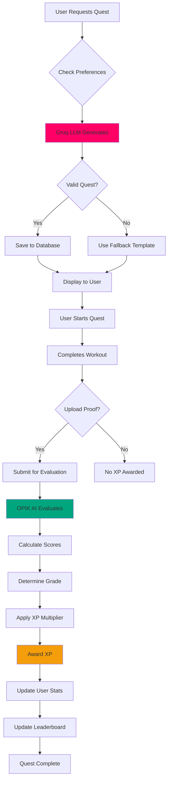

# Quest Flow

The complete lifecycle of an ASCEND quest from generation to completion.

## Quest Lifecycle

## Phase Breakdown

### 1. Quest Generation (10-30 seconds)

| Step | Action |
| ---- | ------ |
| 1 | User selects preferences |
| 2 | Profile data sent to Groq LLM |
| 3 | LLM generates quest JSON |
| 4 | Zod validates structure |
| 5 | Quest saved to database |

### 2. Quest Execution (15-90 minutes)

| Step | Action |
| ---- | ------ |
| 1 | User reviews quest |
| 2 | Starts timer |
| 3 | Completes exercises |
| 4 | Notes completion time |

### 3. Proof Submission (5-10 seconds)

| Step | Action |
| ---- | ------ |
| 1 | User uploads photo/video |
| 2 | Optional notes added |
| 3 | Proof submitted for evaluation |

### 4. Evaluation (5-30 seconds)

| Step | Action |
| ---- | ------ |
| 1 | Proof received by OPIK AI |
| 2 | Video/image analysis |
| 3 | Scores calculated |
| 4 | Grade determined |
| 5 | XP awarded |

### 5. Results Display (Instant)

| Step | Action |
| ---- | ------ |
| 1 | Evaluation trace shown |
| 2 | XP added to total |
| 3 | Leaderboard updated |
| 4 | Quest marked complete |

## Time Summary

| Phase | Duration |
| ----- | -------- |
| Generation | 10-30 seconds |
| Execution | 15-90 minutes |
| Submission | 5-10 seconds |
| Evaluation | 5-30 seconds |
| Total | ~15-91 minutes |

[Learn about the XP System →](./xp-system.md)

---

*Last Updated: February 11, 2026*
