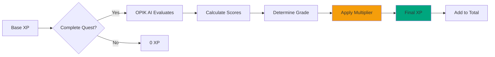

# XP System

How XP works in ASCEND, from base calculation to final rewards.

## XP Calculation

## Base XP by Rank

| Rank | Base XP Range | Difficulty |
| ---- | ------------- | ---------- |
| E | 100-200 | Beginner |
| D | 200-500 | Easy |
| C | 500-1,000 | Moderate |
| B | 1,000-2,000 | Hard |
| A | 2,000-4,000 | Expert |
| S | 4,000-8,000 | Master |

## Multipliers

Evaluation grade determines XP multiplier:

| Grade | Score Range | Multiplier |
| ----- | ----------- | ---------- |
| S | 0.90-1.00 | 1.5x |
| A | 0.80-0.89 | 1.3x |
| B | 0.70-0.79 | 1.1x |
| C | 0.60-0.69 | 1.0x |
| D | 0.50-0.59 | 0.9x |
| E | 0.00-0.49 | 0.8x |

## XP Calculation Examples

### Example 1: C-Rank Quest, B Grade

| Value | Calculation |
| ----- | ----------- |
| Base XP | 800 |
| Grade | B (0.75 score) |
| Multiplier | 1.1x |
| **Final XP** | **800 × 1.1 = 880** |

### Example 2: S-Rank Quest, S Grade

| Value | Calculation |
| ----- | ----------- |
| Base XP | 4,500 |
| Grade | S (0.95 score) |
| Multiplier | 1.5x |
| **Final XP** | **4,500 × 1.5 = 6,750** |

### Example 3: D-Rank Quest, E Grade

| Value | Calculation |
| ----- | ----------- |
| Base XP | 300 |
| Grade | E (0.35 score) |
| Multiplier | 0.8x |
| **Final XP** | **300 × 0.8 = 240** |

## Leveling System

| Level | XP Required | Rank |
| ----- | ----------- | ---- |
| 1-10 | 0-1,000 | E |
| 11-20 | 1,001-2,500 | D |
| 21-30 | 2,501-5,000 | C |
| 31-50 | 5,001-12,000 | B |
| 51-70 | 12,001-25,000 | A |
| 71-100 | 25,001+ | S |

## XP Sources

| Source | XP Range |
| ------ | -------- |
| Quest completion | 80-12,000 |
| Daily login bonus | 50-100 |
| Streak bonus | +5% per day |
| Kudos received | 10-50 |

[Learn about Quest Flow →](./quest-flow.md)

---

*Last Updated: February 11, 2026*
