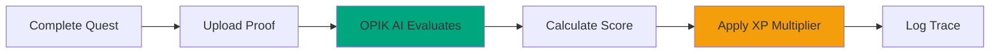

# OPIK AI

OPIK AI evaluates every quest completion using three factors: form quality (40%), effort level (30%), and consistency (30%). Overall score determines XP multiplier.

## System Flow

## XP Multipliers

| Overall Score | Grade | Multiplier |
|--------------|--------|-----------|
| 0.90-1.00 | S | 1.5x |
| 0.80-0.89 | A | 1.3x |
| 0.70-0.79 | B | 1.1x |
| 0.60-0.69 | C | 1.0x |
| 0.50-0.59 | D | 0.9x |
| 0.00-0.49 | E | 0.8x |

## Production Example

S-Rank Assassin quest completion:
- Form: 0.92, Effort: 0.95, Consistency: 0.88
- Overall: 0.92 (S Grade), Multiplier: 1.5x
- Base XP: 4,500, Final XP: 6,750

## Transparency

Users can view complete evaluation traces showing form score, effort score, consistency score, XP calculation, and feedback. Opt-out available anytime.

## Implementation

[Judge Algorithm](./opik-ai-judge.md) • [Flow Diagrams](./opik-ai-flow-diagrams.md) • [Trace System](./trace-implementation.md)

---

*Last Updated: February 10, 2026*
