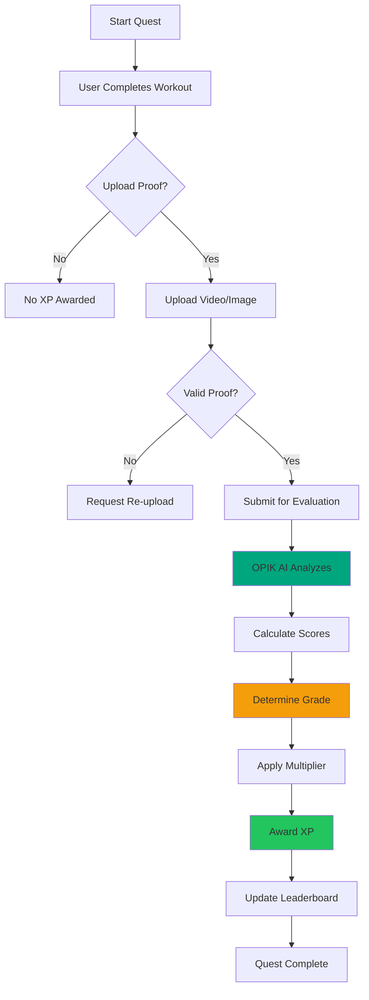
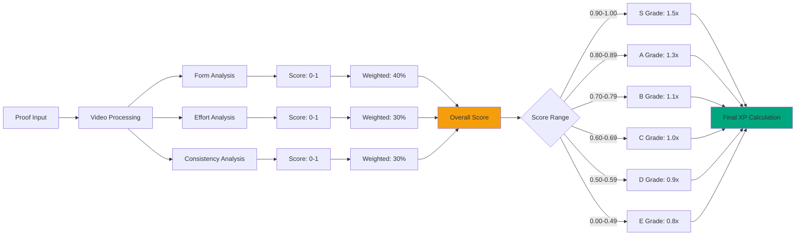

# Flow Diagrams

## Complete Quest Flow

```mermaid
graph TD
    A[Start Quest] --> B[User Completes Workout]
    B --> C{Upload Proof?}
    C -->|No| D[No XP Awarded]
    C -->|Yes| E[Upload Video/Image]

    E --> F{Valid Proof?}
    F -->|No| G[Request Re-upload]
    F -->|Yes| H[Submit for Evaluation]

    H --> I[OPIK AI Analyzes]
    I --> J[Calculate Scores]
    J --> K[Determine Grade]
    K --> L[Apply Multiplier]

    L --> M[Award XP]
    M --> N[Update Leaderboard]
    N --> O[Quest Complete]

    style I fill:#00a67e
    style K fill:#f59e0b
    style M fill:#22c55e
```

## Evaluation Flow

```mermaid
graph LR
    A[Proof Input] --> B[Video Processing]
    B --> C[Form Analysis]
    B --> D[Effort Analysis]
    B --> E[Consistency Analysis]

    C --> F[Score: 0-1]
    D --> G[Score: 0-1]
    E --> H[Score: 0-1]

    F --> I[Weighted: 40%]
    G --> J[Weighted: 30%]
    H --> K[Weighted: 30%]

    I --> L[Overall Score]
    J --> L
    K --> L

    L --> M{Score Range}
    M -->|0.90-1.00| N[S Grade: 1.5x]
    M -->|0.80-0.89| O[A Grade: 1.3x]
    M -->|0.70-0.79| P[B Grade: 1.1x]
    M -->|0.60-0.69| Q[C Grade: 1.0x]
    M -->|0.50-0.59| R[D Grade: 0.9x]
    M -->|0.00-0.49| S[E Grade: 0.8x]

    N --> T[Final XP Calculation]
    O --> T
    P --> T
    Q --> T
    R --> T
    S --> T

    style L fill:#f59e0b
    style T fill:#00a67e
```

## Trace Recording Flow

```mermaid
graph LR
    A[Evaluation Complete] --> B[Create Trace ID]
    B --> C[Record Timestamp]
    C --> D[Store User ID]
    D --> E[Store Quest ID]

    E --> F[Save Form Score]
    F --> G[Save Effort Score]
    G --> H[Save Consistency Score]
    H --> I[Save Overall Score]

    I --> J[Save Grade]
    J --> K[Save Multiplier]
    K --> L[Save Base XP]
    L --> M[Save Final XP]

    M --> N[Generate Feedback]
    N --> O[Store in Database]
    O --> P[Send to User]

    style O fill:#00a67e
    style P fill:#22c55e
```

[Learn about Trace Implementation →](./trace-implementation.md)

---

*Last Updated: February 11, 2026*
