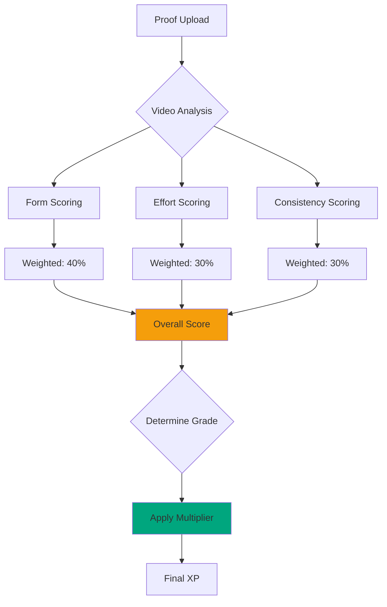

# Judge System

The OPIK AI Judge System uses a multi-factor evaluation algorithm to determine quest completion quality.

## Algorithm Overview

## Scoring Breakdown

### Form Quality (40%)

Evaluates exercise technique:
- Joint alignment
- Movement range
- Body position
- Tempo control

### Effort Level (30%)

Measures intensity:
- Heart rate patterns
- Movement speed
- Breathing patterns
- Fatigue indicators

### Consistency (30%)

Assesses uniformity:
- Rep-to-rep consistency
- Set-to-set uniformity
- Time interval adherence
- Rest period tracking

## Grade Determination

| Score Range | Grade | Description |
| ----------- | ----- | ----------- |
| 0.90-1.00 | S | Perfect execution |
| 0.80-0.89 | A | Excellent technique |
| 0.70-0.79 | B | Good form |
| 0.60-0.69 | C | Acceptable |
| 0.50-0.59 | D | Needs improvement |
| 0.00-0.49 | E | Poor execution |

## Edge Cases

**Incomplete proof:** Minimum 30 seconds required

**Poor quality video:** Request re-upload

**Suspicious activity:** Flag for manual review

[View Flow Diagrams →](./flow-diagrams.md)

---

*Last Updated: February 11, 2026*
