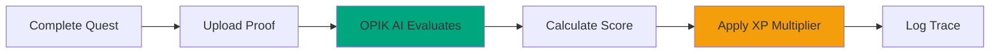

# Overview

OPIK AI evaluates every quest completion using three factors: form quality (40%), effort level (30%), and consistency (30%). Overall score determines XP multiplier.

## How It Works

## Evaluation Factors

| Factor           | Weight | What It Measures                     |
| ---------------- | ------ | ------------------------------------ |
| **Form Quality** | 40%    | Exercise technique accuracy          |
| **Effort Level** | 30%    | Intensity and exertion               |
| **Consistency**  | 30%    | Rep-to-rep and set-to-set uniformity |

## XP Multipliers

| Overall Score | Grade | Multiplier |
| ------------- | ----- | ---------- |
| 0.90-1.00     | S     | 1.5x       |
| 0.80-0.89     | A     | 1.3x       |
| 0.70-0.79     | B     | 1.1x       |
| 0.60-0.69     | C     | 1.0x       |
| 0.50-0.59     | D     | 0.9x       |
| 0.00-0.49     | E     | 0.8x       |

## Production Example

**S-Rank Assassin quest completion:**

| Metric         | Score              |
| -------------- | ------------------ |
| Form           | 0.92               |
| Effort         | 0.95               |
| Consistency    | 0.88               |
| **Overall**    | **0.92 (S Grade)** |
| **Multiplier** | **1.5x**           |

**XP Calculation:**

* Base XP: 4,500
* Multiplier: 1.5x
* Final XP: 6,750

## Transparency

Users can view complete evaluation traces showing:

* Form score breakdown
* Effort score breakdown
* Consistency score breakdown
* XP calculation
* Personalized feedback

**Opt-out available anytime.**

[Learn about the Judge System →](judge-system.md)

***

_Last Updated: February 11, 2026_
